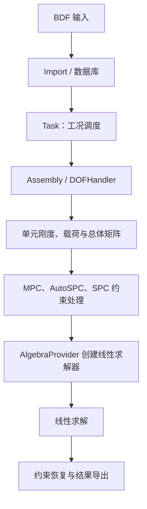
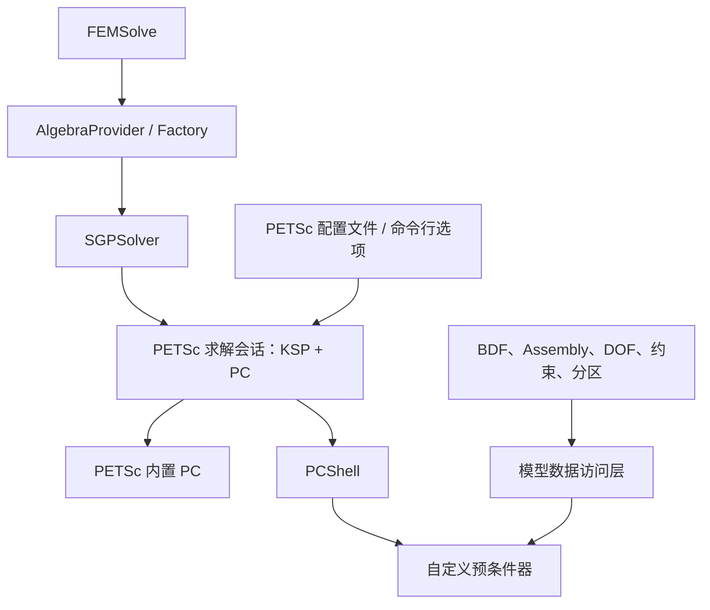

# SGSim 架构、求解流程与 SGPSolver 设计

本文记录当前 SGSim 交付环境中，线性结构分析从 BDF 输入到线性方程求解的实际架构、已经核验的能力、源码与接口权限边界，以及自定义求解器 `SGPSolver` 的扩展设计。

本文中的“已公开”仅表示当前开发环境中存在可读源码或公开头文件；“未开放”表示当前交付中仅有预编译库、公开声明，或者相关目录为空。该分类不涉及甲方源代码仓库中是否保存了相应实现。

讨论范围限定为以 `SOL 101` 为代表的线性结构静力方程及其线性求解阶段。屈曲、瞬态、非线性和结果后处理可能复用其中一部分对象，但其完整调度流程不在本文结论范围内。

## 现有软件架构

SGSim 的运行对象可分为输入与数据层、有限元处理层、代数求解层和任务调度层。

| 层次        | 模块                                                          | 职责                                  | 当前可见性                             |
| --------- | ----------------------------------------------------------- | ----------------------------------- | --------------------------------- |
| 程序入口      | `Main`                                                      | 初始化 Algebra、数据库和项目目录；调用模型导入与任务执行    | 源码公开                              |
| 模型导入      | `Import`、`BDFImport`                                        | 读取 BDF，并写入模型数据库                     | 源码公开                              |
| 数据层       | `DataStructure`、`DBManager`                                 | 节点、单元、材料、属性、载荷、约束、工况及结果的数据定义与持久化    | 数据结构源码公开；DBManager 既有源码也可能使用预编译产物 |
| 单元与组装     | `SGFem/ElementCalculator`、`SGFem/Pre/Assembly`、`DOFHandler` | 单元刚度与载荷计算、自由度编号、总体矩阵组装、约束处理         | 大部分源码公开                           |
| 连接与壳截面预处理 | `PreProcess`、`ShellSecCalculator`                           | CWELD/CFAST 面片与虚节点处理；壳截面与复合材料等效刚度计算 | 部分仅有公开头文件和预编译库                    |
| 代数层       | `Algebra`                                                   | 稀疏矩阵、向量、线性求解器工厂、MPI/PETSc 封装        | 仅有公开头文件和预编译库                      |
| 并行分区      | `Partition`                                                 | 模型和网格的并行分区及其数据组织                    | 当前目录为空，仅有间接调用和预编译依赖               |
| 任务调度      | `SGFem/Task`                                                | 组织工况、组装、求解、结果恢复和导出                  | 当前目录为空                            |
| 结果导出      | `Export`                                                    | BDF、HDF5/NH5、VTK 等结果输出              | 源码公开                              |

从程序入口观察，主程序先调用 `SG::Algebra::Initialize(argc, argv)`，再调用 `SGImporter::Import()` 导入模型。后续由任务调度层决定具体工况的组装、约束、求解和导出次序。由于 `SGFem/Task` 当前没有源码，任务调度的完整控制流不能仅通过现有工作树还原。



图中的 `Task`、`Partition` 和部分预处理实现构成当前主要的源码边界；其余路径能够通过公开源码、头文件和运行行为核验。

## 线性静力求解流程

线性结构静力分析的离散平衡方程写为：

$$
K u=f.
$$

其中 $K$ 是未施加代数约束时的总体刚度矩阵，$u$ 是模型自由度向量，$f$ 是载荷向量。SGSim 的实际计算过程并非直接把这一方程交给线性求解器，而是先完成自由度组织和约束约化。

**模型导入与工况识别。** BDF 导入阶段将 `GRID`、单元、材料、属性、载荷、`SPC`、`MPC`、`RBE` 和子工况等对象写入数据库。线性静力工况引用的载荷集和约束集随后由组装与任务调度层读取。

当前公开测试与源码中已出现的结构对象包括梁、杆、壳、实体、剪切板、集中质量、弹簧/阻尼、刚性连接、分布连接和焊接/紧固件连接。该事实不等同于“所有字段、所有分析序列均完全兼容”；具体卡片的兼容性仍应以实际 BDF 运行和结果校核为准。

**自由度编号与连接预处理。** `AssemblyEigen::Initialize()` 在串行路径中读取节点集合，调用坐标处理、CWELD/CFAST 预处理和 `DOFHandler`。代码以 `IGridDOFIndexService::GetGridDOFIndexes()` 是否已有数据区分串行初始化路径与 HPC 环境中已组织自由度编号的路径。

CWELD 和 CFAST 的原始 BDF 卡片不能直接等同于一条简单的刚度边：它们还需要确定连接两侧的面片、投影点、局部坐标、虚节点及位移传递关系。当前公开头文件说明：

- `PreProcessNewWeld()`、`PreProcessOldWeld()` 处理 CWELD；
- `PreProcessCfast()` 为 CFAST 生成 RBE3 并填充虚节点；
- 后续连接单元计算器据此形成连接刚度并组装到相关自由度。

这些预处理函数的实现不在当前源码树中，因此可以调用和观察其结果，但不能把现有 BDF 卡片解释为已经拥有全部局部连接算子。

**单元组装。** 单元计算器形成单元刚度、质量、阻尼或等效载荷，并由 `AssemblyEigen` 组装为总体代数对象。当前公开源码中可以直接检查多类梁、壳、实体、剪切板、质量、阻尼、弹簧和连接单元计算器。

PCOMPG 是复合材料层合壳属性。其铺层材料、厚度和方向影响壳截面的膜内、弯曲、剪切及耦合刚度。PCOMPG 数据结构和 BDF 解析路径可见；复合壳截面等效刚度的部分实现位于预编译的 `ShellSecCalculator` 中。因此，可通过 BDF 和最终矩阵分析其数值影响，但不能仅靠当前源码保证重写出与 SGSim 完全一致的截面计算细节。

**多点约束约化。** MPC、RBE 及部分连接预处理产生从属自由度。SGSim 在 `AssemblyEigen::Constraint()` 中构造控制矩阵 $G$，使从属自由度 $u_m$ 表示为主动自由度 $u_a$ 的线性组合：

$$
u_m=G u_a.
$$

若未约化矩阵按主动/从属自由度分块为

$$
K=
\begin{bmatrix}
K_{nn} & K_{nm}\\
K_{nm}^{\mathsf T} & K_{mm}
\end{bmatrix},
$$

则代码采用的静态凝聚形式为：

$$
K_r=
K_{nn}
+G^{\mathsf T}K_{nm}^{\mathsf T}
+K_{nm}G
+G^{\mathsf T}K_{mm}G.
$$

相应地，载荷中的从属分量通过 $G^{\mathsf T}$ 回代入独立方程。组装对象已提供 `GetDependentDOFTransformation()`，用于查询当前约束处理实际形成的 $G$。该矩阵采用 Assembly 内部编号：其列并不自动声明为最终 PETSc 全局方程号，因而不能把它直接当作并行 PETSc 的 local-to-global mapping。

**AutoSPC 与单点约束。** 若子工况启用 `AUTOSPC`，且当前分析类型和参数允许，SGSim 在 MPC 凝聚后检查节点平动与转动自由度对应的局部刚度子块。程序根据特征值与 `EPZERO` 的比值识别低刚度方向，将相关自由度转入固定自由度集合，并重排矩阵、载荷和约束变换。

AutoSPC 的结果依赖当前总体刚度、约束状态和参数阈值；它不是可由 BDF 静态卡片单独推导出的固定边界条件。显式 `SPC`、`SPCD` 和 AutoSPC 完成后，最终独立方程构成线性求解器的输入空间。

**线性求解与结果恢复。** `AlgebraProvider` 按求解器类型字符串从 `Base::Factory` 创建 `TLinearSolver<Real_t>`。该抽象的稳定接口为：

```cpp
void compute(const SparseMatrixType& A);
void solve(const VectorType& b, VectorType& x) const;
```

求解器接收的是约束处理后的最终系统 $A x=b$。求解完成后，任务调度与组装层需要将固定自由度和从属自由度恢复至模型自由度空间，再完成位移、应力、应变和连接单元结果输出。恢复和导出的完整编排属于当前未开放的 Task 调度范围。

## 已核验能力与权限边界

下表只记录已经通过公开接口、源码或实际运行确认的能力。

|能力|结论|边界|
|---|---|---|
|自定义线性求解器|可行。应用模块可运行时向 `Base::Factory` 注册 `TLinearSolver<Real_t>` 的 Producer|需在程序启动阶段显式执行注册，避免静态库对象被链接器丢弃|
|不修改 FEMSolve 接入求解器|可行。FEMSolve 通过 `AlgebraProvider` 按类型字符串创建求解器|仅限遵守 `compute(A)`、`solve(b,x)` 接口的线性求解器|
|PETSc 原生矩阵访问|可行。`PetscSparseMatrix` 提供 `Mat mat()`|矩阵由 SGSim 所有；自定义模块只能借用，不应销毁|
|PETSc 内置 KSP/PC|可行。自定义求解器可自行创建 KSP、获取 PC、设置类型并调用 `KSPSetFromOptions()`|参数读取与优先级应由自定义模块明确实现|
|自定义 PETSc 预条件器|可行。通过 `PCShell` 回调接入|回调中的向量所有权、通信域和资源生命周期必须由模块管理|
|MPI 分布式最终系统|已观察到最终 $A$ 为按行分布的 MPIAIJ 矩阵|最终矩阵不自动携带物理子域、单元归属或接口语义|
|代数 ASM/重叠 Schwarz|可直接由 PETSc 的 ASM 或矩阵非零图支持|其子域是代数行块/图重叠，不等同于 SGSim 的物理单元子域|
|PETSc PCBDDC|不能直接作用于现有 MPIAIJ 总体矩阵|PCBDDC 需要由物理子域局部矩阵和局部—全局映射构造 MATIS 或等价对象|

对最终 MPIAIJ 矩阵调用 `MatGetLocalToGlobalMapping()` 未得到行、列映射。这与 PETSc 的正常行分布矩阵语义一致：行所有权范围说明哪一个进程拥有最终方程行，但不保存“该行对应哪个模型自由度、由哪些单元贡献、属于哪个物理子域”的信息。

当前可直接读取、调用或修改的部分包括：

1. BDF 输入文件及其原始模型语义；
2. `DataStructure` 中的节点、单元、材料、属性、约束和载荷数据结构。
3. `AssemblyEigen`、`DOFHandler` 和大量单元计算器源码。
4. 约束后总体矩阵、右端项和解向量；自定义 `TLinearSolver` 可在求解阶段取得这些对象。
5. PETSc 矩阵包装类及其原生 `Mat` 访问接口。
6. 当前约束处理产生的从属自由度控制矩阵 $G$，其适用期截止至下一次 `Clear()` 或 `Constraint()`。
7. `AlgebraProvider`、`Factory`、`TLinearSolver` 等公开扩展头文件。

当前未通过稳定接口提供的部分包括：

1. 每个 MPI 进程实际拥有的模型单元、共享节点、ghost 节点和原始分区结果；
2. 与 SGSim 原始分区一致的局部未装配子域矩阵 $K_i$。
3. 物理子域全部局部自由度到最终 PETSc 全局方程号的映射 $L_i$。
4. CWELD/CFAST 的完整面片搜索、投影、虚节点和 RBE3 生成算法。
5. PCOMPG 及其他复合壳截面的全部等效刚度实现。
6. Task 对组装、求解、结果恢复与导出的完整调度代码。
7. Partition 的实现和原始分区数据库的查询语义。

单进程运行不会改变以上源码边界。它能够避免 MPI 分区带来的数据分布问题，并便于验证单元、约束和总体矩阵；但不会使预编译库的内部实现转为可读源码，也不会产生原始并行分区数据。

因此，当前权限足以实现以下类别的预条件器：

- 仅利用最终矩阵的 Krylov、直接法、AMG、ILU、ASM 和图算法；
- 结合 BDF 网格拓扑和可查询约束关系的节点块、单元 patch 或物理分组方法；
- 通过 PCShell 实现的自定义代数预条件器。

若算法要求严格复用 SGSim 的物理并行子域，则仅有最终 $A$ 不足。此时需要每个物理子域的局部矩阵 $K_i$ 与映射 $L_i$，使总体方程满足：

$$
A=\sum_i L_i^{\mathsf T}K_iL_i.
$$

该数据是构造物理区域分解和 PETSc MATIS/PCBDDC 的必要输入。后续可作为受控接口提供，当前不应假定其已经随 MPIAIJ 矩阵传入线性求解器。

## SGPSolver 设计

`SGPSolver` 是面向 SGSim 的自定义线性求解器扩展入口。名称不绑定 PETSc；第一阶段在内部采用 PETSc，实现稳定后可按需要扩展其他数值后端。

`SGPSolver` 的职责是连接 SGSim 的 `TLinearSolver` 生命周期、自定义预条件器、模型数据访问和求解诊断。它不承担 BDF 导入、有限元组装、约束消元或结果恢复；这些职责仍保留在现有 SGSim 流程中。



**接入。** `SGPSolver` 继承 `TLinearSolver<Real_t>`，实现 `compute(A)` 与 `solve(b,x)`。模块加载时通过 `Base::GeneralProducer<SGPSolver>` 注册；主程序在 Algebra 初始化后显式调用注册函数。

配置中的求解器类型改为：

```json
"Solver": {
  "LinearReal": {
    "Value": "SGPSolver<Real_t>"
  }
}
```

该接入方式利用现有 Algebra 工厂，不需要修改 FEMSolve 的求解器创建逻辑。

**PETSc 求解会话。** 第一阶段的 `SGPSolver` 内部维护一个 PETSc 求解会话，其中包含 KSP、PC、配置和诊断对象。

|阶段|职责|
|---|---|
|`compute(A)`|借用 SGSim 的原生 `Mat`；创建或更新 KSP；设置算子；建立或重建预条件器|
|`solve(b,x)`|按本进程方程所有权构造 PETSc `Vec`；复制 RHS 与初值；调用 `KSPSolve`；回写解向量|
|重复 RHS 求解|复用已建立的 KSP/PC；不重新解释矩阵|
|下一次 `compute(A)`|根据新矩阵重新设置算子和预处理数据|
|析构|释放模块创建的 KSP、PC、Vec 等对象；不销毁 SGSim 所有的 `Mat`|

SGSim 的 `PetscSparseMatrix` 已提供 `Mat mat()`。`b`、`x` 的包装和所有权必须在 `solve()` 内明确处理，不能假定任意 SGSim 向量都可直接作为 PETSc KSP 的输入向量。

**预条件器。** 预条件器应只依赖明确的数据视图，不直接依赖 BDF 解析器、数据库内部对象或 Task 私有实现。建议的抽象为：

```cpp
class IPreconditioner {
public:
    virtual void setup(const LinearSystemView& system,
                       const ModelDataAccess* model) = 0;
    virtual void apply(Vec rhs, Vec solution) = 0;
    virtual void update() = 0;
    virtual ~IPreconditioner() = default;
};
```

第一阶段可以实现两类对象：

- PETSc 内置 PC 的配置适配器；
- 以 `PCShellSetApply()` 接入的自定义预条件器。

`LinearSystemView` 是必需对象，至少包含原生 `Mat`、MPI communicator、矩阵全局维度和本进程方程行所有权范围。它足以实现纯代数预条件器。

**模型数据访问。** 模型数据访问层是预条件器与有限元模型之间的只读边界。第一阶段不要求实现完整的并行子域访问，只保留下列接口类别：

- 网格与单元拓扑；
- 单元—模型自由度关联；
- 模型自由度与约束后方程空间的关系；
- 约束变换和固定自由度信息；
- 单元局部算子或其查询接口；
- 物理子域局部矩阵、局部—全局映射和接口信息。

前四项可逐步由 BDF、Assembly 和公开数据结构填充。最后一项暂定义为空接口；当需要区域分解、MATIS 或 PCBDDC 时，再由 Partition/Assembly 提供实现。这样不会改变 `SGPSolver`、KSP 生命周期或 PCShell 的主体结构。

**配置与诊断。** PETSc 参数不应依赖 FEMSolve 的未公开配置注入路径。`SGPSolver` 应自行约定并实现配置来源，例如模块配置文件、PETSc options 文件和命令行参数，并明确优先级。

每次求解至少记录：

- 实际 KSP 与 PC 类型；
- 收敛原因、迭代步数和最终残差；
- `compute()` 与 `solve()` 耗时；
- 矩阵维度、本进程行所有权范围和 MPI 规模；
- 实际生效的 PETSc 选项；
- 预条件器建立失败或迭代失败的 PETSc 错误信息。

这些记录既用于验证配置是否真正生效，也用于比较不同预条件器在同一 BDF 工况上的数值行为。

**实施顺序。**

1. 建立 `SGPSolver`、显式注册函数和独立配置读取；
2. 完成 PETSc KSP/PC 生命周期管理，验证 CG、GMRES、ASM、GAMG 等内置组合。
3. 建立 PCShell 适配器和自定义预条件器注册机制。
4. 建立模型数据访问层的 BDF、自由度和约束适配器。
5. 在需要物理区域分解时，补充每个子域的 $K_i$、$L_i$ 与接口信息，并构造 MATIS/PCBDDC 适配器。

前 1 至 3 步只依赖当前公开的 Algebra 扩展点和 PETSc 包装接口，可以立即开展。第 4 步受约束编号语义与预处理数据可见性影响。第 5 步需要新增稳定的并行分区数据接口，不能以最终 MPIAIJ 矩阵反推替代。

> **核验依据。** 本文结论基于当前工作树及与其匹配的 Linux Artifact 头文件。关键依据包括：

- `Main/SGFEM.cpp`：Algebra 初始化与 BDF 导入入口；
- `Artifact/Ubuntu22-gcc11.4/include/Algebra/AlgebraProvider.h`：按类型字符串创建线性求解器；
- `Artifact/Ubuntu22-gcc11.4/include/Algebra/Factory.h`：运行时 Producer 注册；
- `Artifact/Ubuntu22-gcc11.4/include/Algebra/LinearSolver.h`：`TLinearSolver` 的 `compute/solve` 接口；
- `Artifact/Ubuntu22-gcc11.4/include/Algebra/sgPetscSpace.h`：原生 PETSc `Mat` 访问；
- `SGFem/Pre/Assembly/Assembly.cpp`：连接预处理调用、MPC 凝聚和 AutoSPC 顺序；
- `SGFem/Pre/Assembly/Assembly.h`：从属自由度控制矩阵 $G$ 的查询接口；
- `Artifact/Ubuntu22-gcc11.4/include/SGFem/PreProcess/PreprocessModel.h`：CWELD/CFAST 预处理函数声明。
