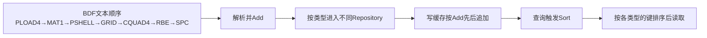
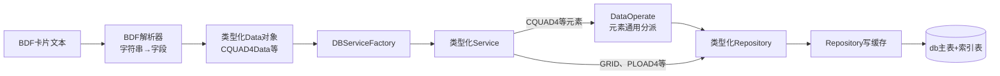
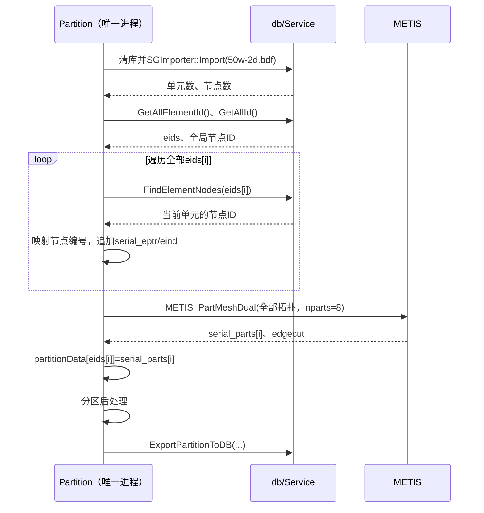
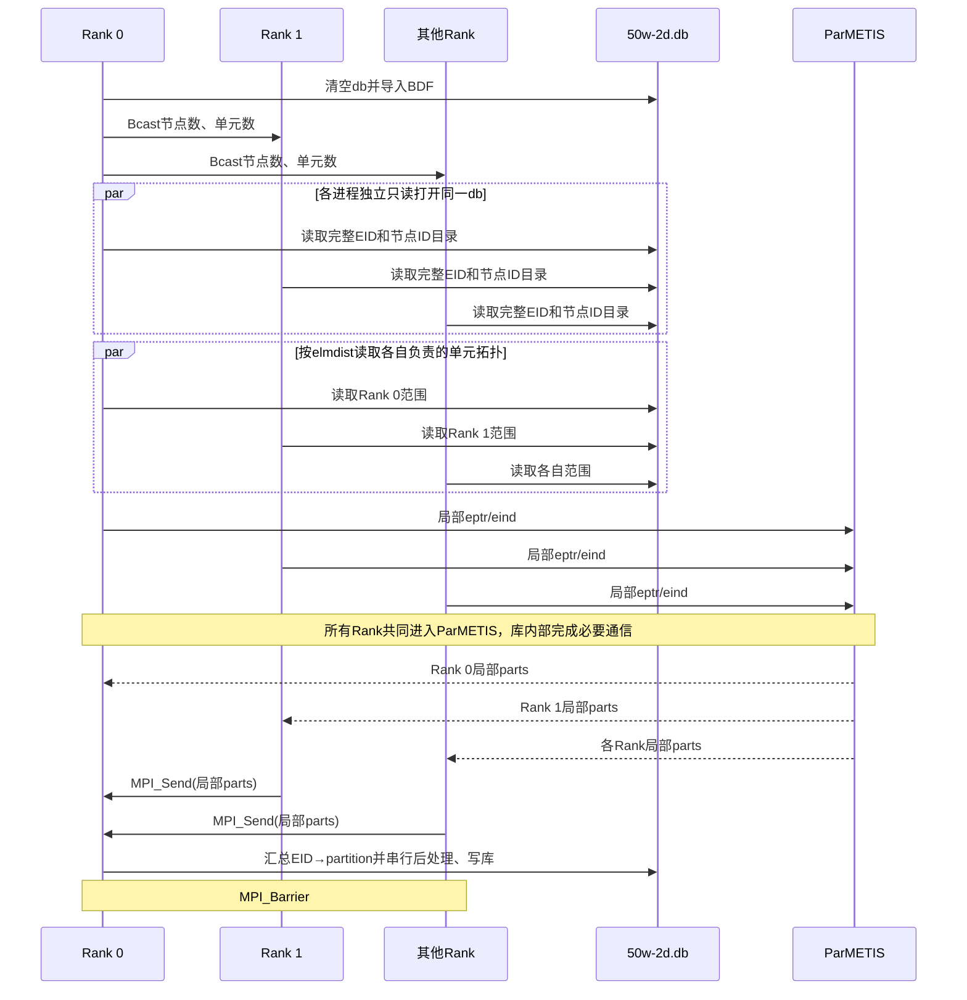
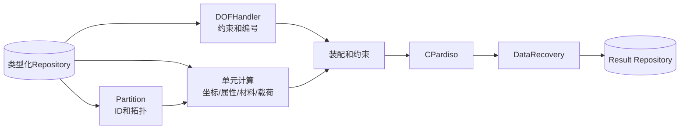

> 来源：宋维豪（算海），2026-09-12 发出（`BDF到DBManager与Partition计算数据流.md`，23.1 KB）。文中含 SGSim 接口与源码片段、内部路径及 `50w-2d` 算例与运行日志数据，**经用户确认已取得算海对本文档的公开授权**后入仓。原文照录归档，未作改写。

# 从BDF到db、Partition与求解的数据流

本文将SGSim生成的 `50w-2d.db` 简称为“db”；它采用HDF5格式。除BDF原始卡片和代码标识外，下文不再重复说明存储格式。

## 1. 结论与证据范围

本算例的核心流程是：

```text
50w-2d.bdf
→ 解析为NodeData、CQUAD4Data、PLOAD4Data等结构
→ 按类型写入db中的Repository
→ 从db读取单元ID和拓扑
→ METIS按共享节点关系生成8个partition
→ 按EID分配载荷
→ 后续求解继续通过DBServiceFactory读取数据
```

本文证据范围：

- `Artifact/Ubuntu22-gcc11.4/include` 中的公开头文件；
- `DBManager` 中与Repository写缓存、排序和汇总表直接相关的源码；
- `/home/peter/repositories/SGSim/Partition` 源码；
- `50w-2d.bdf`、Partition日志和实际VTK输出。

证据标记：

- **已确认**：Partition源码、公开头文件或实际输出直接支持；
- **逻辑关系**：数据字段依赖成立，但未确认求解器内部逐函数顺序；
- **未确认**：具体BDF解析函数体、Repository的实际缓存上限与数据集chunk配置、重复ID策略以及求解器内部实现未查看。

---

## 2. 50w-2d.bdf保存了什么

### 2.1 分析工况

```text
SOL 101
SUBCASE 2
LOAD = 19
SPC = 9
```

这是线性静力学工况。`MDLPRM HDF5 0` 是BDF参数卡，与SGSim生成db的存储方式无关。

### 2.2 主要卡片统计

| 卡片 | 数量 | 含义 |
|---|---:|---|
| GRID | 98,910 | 节点ID和坐标 |
| CQUAD4 | 97,782 | 四节点壳单元 |
| PSHELL | 3 | 壳属性和厚度 |
| MAT1 | 1 | 材料 |
| PLOAD4 | 32,594 | 壳面压力 |
| SPC | 1,635 | 单点约束 |
| RBE2 | 10,543 | 刚性约束 |
| RBE3 | 10,948 | 加权约束 |

该模型没有Nastran超单元卡片。

### 2.3 ID是关联键，不代表BDF文件位置

`EID` 是Element ID，即真实单元编号，不是BDF行号、数组下标或partition编号。BDF也不是把所有数据按单元编号混合排列的文件；它允许载荷、节点、单元、材料和约束按不同卡片块出现，并通过ID建立跨块引用。

50w-2d.bdf的实际卡片顺序是：

| BDF起始行范围 | 卡片 | 数量 | 排列含义 |
|---|---|---:|---|
| 14～32607 | PLOAD4 | 32,594 | 先写面压力载荷，引用后面才出现的单元EID |
| 32608 | LOAD | 1 | 把SID 21组合为工况LOAD 19 |
| 32609 | MAT1 | 1 | 材料 |
| 32613～32619 | PSHELL | 3 | 壳属性；中间穿插注释行 |
| 32621～131530 | GRID | 98,910 | 节点ID和坐标 |
| 131532～229313 | CQUAD4 | 97,782 | 物理壳单元 |
| 229318～239860 | RBE2 | 10,543 | 刚性约束单元 |
| 239865～261759 | RBE3 | 10,948 | 加权约束单元；包含续行 |
| 261768～263402 | SPC | 1,635 | 单点约束 |

例如，相关的四条记录并没有相邻排列：

```text
第14行：    PLOAD4,21,465972,-5.E-6,-5.E-6,-5.E-6,-5.E-6
第196720行：CQUAD4,465972,4,470458,471198,471197,470453
第32619行： PSHELL,4,1,0.3,1,,1
第32609行： MAT1,1,200000.0,,0.3,7.85E-9,1.2E-5,22.0
```

含义：

```text
PLOAD4：SID=21，作用于EID=465972
CQUAD4：EID=465972，PID=4
节点：470458、471198、471197、470453
PSHELL 4：MID=1，厚度0.3
MAT1 1：E=200000，NU=0.3
```

这四条记录在文件中相距很远，但可以通过 `PLOAD4.EID → CQUAD4.EID → PSHELL.PID → MAT1.MID` 关联。可见“编号相同或相互引用”不要求“文本中相邻”，前向引用也不意味着数据缺失。

另外，第94085行还有 `GRID,465972,...`。这里的465972是节点ID，和 `CQUAD4` 的EID 465972属于不同ID命名空间，数值相同并不表示它们是同一对象。

### 2.4 CQUAD4卡片内部的EID分段

只观察BDF中的CQUAD4卡片块，其内部恰好按EID递增，并分成三段：

| PID | 单元数 | EID范围 |
|---:|---:|---|
| 1 | 32,594 | 335230～367823 |
| 3 | 32,594 | 433378～465971 |
| 4 | 32,594 | 465972～498565 |

这里描述的是**CQUAD4卡片块内部**，不能推广成“整个BDF按EID排列”。`367824～433377` 没有被CQUAD4、RBE2或RBE3使用。EID允许不连续；该缺口很可能来自前处理编号、模型合并、删除或预留，但当前BDF不能确定具体原因，也没有特殊求解含义。

### 2.5 BDF排列顺序对db数据排列的影响

影响要分成“刚写入时”和“供后续查询时”两层理解。



第一，db按类型拆分数据，不保留一个覆盖所有卡片的“BDF全局行序”。PLOAD4进入PLOAD4 Repository，GRID进入Node Repository，CQUAD4进入CQUAD4 Repository；所以“PLOAD4在第14行、CQUAD4在第196720行”不会让它们在db内的同一张表中相隔196,706行。

第二，Repository的 `Add()` 先把实体追加到该类型的写缓存；缓存刷写时再追加到db中对应的主表和索引表。因此，在**尚未排序的初始追加阶段**，同一类型卡片的解析/Add先后可能影响临时物理行序。BDFImporter的具体解析函数体当前不可见，所以本文不把“严格逐行Add”标为已确认。

第三，后续常用查询不会直接依赖这个初始追加顺序。`GetAllId()`、`GetAllData()`、`FindById()` 和 `FindByIndex()` 都会先调用 `Sort()`；`SingleRepositoryBase::SortData()` 会读取该Repository的数据、执行 `std::sort`、重写主表并重建索引表。主要排序键为：

| Repository/汇总表 | 排序键 | 对本算例的结果 |
|---|---|---|
| CQUAD4 | `ElementBase::m_id`，即EID | 335230～367823、433378～498565 |
| ElementSummary | `SummaryInfo::m_id`，即EID | `GetAllElementId()`返回全局EID升序 |
| Node | 先domain，再节点ID | 当前单一domain下按节点ID升序 |
| PLOAD4 | SID、EID、CID、G1、G34、压力值、domain | 当前SID 21下主要表现为EID升序 |

所以对当前50w-2d来说，CQUAD4在BDF里本来就是EID升序，db排序后的结果与其表面上相同；但这是“输入刚好有序”和“Repository会按键排序”共同造成的，不能据此认为db永远保存BDF行序。

如果只打乱BDF中CQUAD4行的先后、而不改变EID和拓扑，导入时的Add顺序可能改变，但 `GetAllElementId()` 触发排序后仍按EID升序，Partition使用的 `eids` 下标顺序不会随这种文本重排改变。相反，若修改EID本身、卡片类型、domain或参与排序的载荷字段，db排序结果和后续数组下标就可能改变。

---

## 3. 如何通过Service操作db

BDF是面向交换和人工阅读的文本；`50w-2d.db` 是面向计算的二进制文件。文本编辑器看到大量 `00/FF` 是正常现象，正确查看工具是 `h5ls`、`h5dump` 或HDFView。

转换不是由解析器直接拼写db数据集完成的，而是经过分层接口：



转换的目的：

1. 数字不必在每个阶段反复从字符串解析；
2. 节点、单元、属性、材料和载荷可以按类型、ID或索引查询；
3. 可以追加partition、DOF映射和计算结果；
4. 后续阶段直接打开DB，不需要再次理解BDF卡片格式。

### 3.1 各层分别负责什么

| 层 | 主要职责 | 不负责什么 |
|---|---|---|
| Data对象 | 保存一条已解析记录的类型化字段 | 不决定db内的存储路径 |
| Service | 向上提供Add、Find、Size等业务接口 | 通常不直接读写db |
| DataOperate | 根据C++数据类型选择元素Repository | 不保存数据 |
| Repository | 管理某类数据的缓存、主表、索引和排序 | 不解析BDF文本 |
| HDF5Database | 创建/持有Repository，统一保存、刷写和断开 | 不理解CQUAD4字段语义 |
| DBServiceFactory | 创建并缓存Service，把Service绑定到当前db | 不复制一份db |

其中Service是调用者与存储实现之间的边界。解析器和后续算法面向 `IElementService`、`INodeService`、`IPLOAD4Service` 等接口；具体数据最终存到哪个Repository，由Service、DataOperate和Repository注册关系决定。

### 3.2 db与Service如何建立联系

Partition的Rank 0先创建db和Service工厂，再把工厂交给导入器：

```cpp
DatabaseFactory dbFactory;
IDatabase* db = dbFactory.GetDatabase(
    DatabaseFactory::HDF5, workspace.string(), dbName);

auto dbManager = std::make_shared<DBServiceFactory>(db);
dbManager->ClearDatabase();

SGImporter importer(dbManager);
importer.Import(inputFile);
```

之后，代码用接口类型请求Service：

```cpp
auto elementService = dbManager->get<IElementService>();
auto nodeService    = dbManager->get<INodeService>();
auto pload4Service  = dbManager->get<IPLOAD4Service>();
```

`DBServiceFactory::get<T>()` 的行为是：

```text
按Service接口类型计算typeid哈希
→ 在m_ServiceRep中查找
→ 已存在：返回同一个Service对象
→ 不存在：向IDatabase请求对应Repository
→ 构造具体Service并缓存
→ 返回接口shared_ptr
```

DB接口侧的 `IDatabase::GetRepository<T>()` 也有一层缓存：

```text
按Repository接口类型计算typeid哈希
→ UpdataRepository检查是否已经创建
→ 必要时由HDF5Database创建具体Repository
→ 保存到m_dataRepositories
→ 返回Repository shared_ptr
```

因此，多次调用 `get<IPLOAD4Service>()` 不会为同一db反复创建PLOAD4 Service和Repository。

### 3.3 CQUAD4的Add路径

以 `CQUAD4,465972,4,470458,471198,471197,470453` 为例：解析后的 `CQUAD4Data` 保存EID、PID和四个节点ID，再经单元Service按C++数据类型分派：

```cpp
elementService->Add<CQUAD4Data>(data);
// IElementService → DataOperate<CQUAD4Data>
// → ICQUAD4Repository::Add(data)
```

`IElementService` 同时处理多种单元，因此用 `DataOperate` 找到对应Repository；在这一层不会重新解析字符串 `"CQUAD4"`。多条同类型数据也有 `MultiAdd` 批量入口。**BDF解析器究竟逐条Add还是分批MultiAdd，仍需其函数体确认。**

### 3.4 其他类型、刷写与读取

GRID和PLOAD4有专用Service，可直接转发到各自Repository：

| 数据 | Add路径 |
|---|---|
| CQUAD4 | `IElementService → DataOperate → ICQUAD4Repository` |
| GRID | `INodeService → NodeRepository` |
| PLOAD4 | `IPLOAD4Service → PLOAD4Repository` |

Repository可将 `Add` 的数据先积累在 `m_writeStorage`；达到 `m_limitSize`，或保存/汇总时调用 `DumpWriteCahce()`，再写入db主表并更新索引。待写缓存随后清空，但Repository对象可以继续存在。**Add成功不等于每条记录都立即落盘；刷写不是MPI通信。** 汇总查询可能先刷写、排序并重建索引，因此db查询顺序不必等于BDF文本行序（见2.5节）。

后续算法仍通过Service读取：

```cpp
auto eids = elementService->GetAllElementId();
auto nodeIds = elementService->FindElementNodes(eid);
```

前者返回单元ID目录，后者按EID取得单元连接节点ID；不会把GRID、材料和载荷重新打包成一条“完整单元”记录。

---

## 4. 50w-2d的实际分区算法

### 4.1 eids是什么

`eids` 是Partition中的内存变量：

```cpp
std::vector<Id_t> eids =
    elemSummaryService->GetAllElementId();
```

它只保存物理单元ID，不保存坐标、材料或载荷。这里的顺序来自db中ElementSummary的排序结果，不是直接保留BDF行序：

```text
GetAllElementId()
→ ElementSummaryRepository::GetAllId()
→ Sort()
→ SummaryInfo::operator< 按m_id（EID）升序
→ 读取排序后的索引表
```

因此本算例得到：

```text
eids[0]     = 335230
...
eids[32593] = 367823
eids[32594] = 433378
...
eids[65188] = 465972
...
eids[97781] = 498565
```

这里CQUAD4在BDF中的出现顺序恰好也是EID升序，所以两种顺序数值一致，但原因不同。即使只打乱CQUAD4文本行，`GetAllElementId()` 返回的EID仍按升序排列。

因此：

```text
BDF行号196720
≠ EID 465972
≠ eids数组下标65188
```

所有MPI进程都从同一db取得排序后的 `eids`，必须保持内容和顺序一致，才能按全局下标切片并正确恢复分区结果。

`eids` 的三个作用：

1. 按 `eids[i]` 查询单元连接节点；
2. 用连续数组位置作为METIS/ParMETIS单元位置；
3. 把 `parts[i]` 恢复成 `真实EID → partitionId`。

### 4.2 本次走串行METIS

本次命令没有使用 `mpirun`：

```bash
Partition \
  -i /home/peter/Desktop/testcases/50w-2d.bdf \
  -w /home/peter/sgsim_partition_comparison/50w-2d_np8_layered_20260830/default \
  -n 8
```

所以：

```text
commSize = 1    一个MPI进程
nparts   = 8    生成8个目标partition
```

代码走 `METIS_PartMeshDual`。由于 `nparts <= 8`，设置为 `METIS_PTYPE_RB`，即递归二分：`1 → 2 → 4 → 8`。若 `commSize > 1` 才走 `ParMETIS_V3_PartMeshKway`。

**判断对象是正在运行的Partition程序，不是SGFEM求解器。** `commSize = world_size()` 来自Partition自身的MPI通信域；`Partition -n 8` 只指定目标网格分区数，不指定MPI进程数。

| 实际启动方式 | Partition的`commSize` | 此`main.cpp`分支 |
|---|---:|---|
| `Partition ... -n 8` | 1 | 串行METIS，产生8个partition |
| `mpirun -np 1 Partition ... -n 8` | 1 | 串行METIS，产生8个partition |
| `mpirun -np 4 Partition ... -n 8` | 4 | ParMETIS，产生8个partition |
| `mpirun -np 8 SGFEM ...` | 不能由此得知 | 只说明求解器有8个Rank，不能据此判定分区算法 |

如果SGFEM只是读取已分区的DB，本次运行不会重新走这两个分区分支。若SGFEM另行调用内置的 `GeneratePartitioning`，也不能套用独立 `Partition/main.cpp` 的条件；其调用位置和选择逻辑尚未在允许的源码范围内确认。本次算例是先单进程运行Partition、再以8个Rank求解，故**分区用串行METIS，求解用8进程**。

本次单进程划分的调用顺序如下。逐单元调用发生在**准备METIS输入**时，METIS接收完整拓扑后只调用一次。



### 4.3 拓扑输入与METIS划分

Partition先把原始GRID ID映射成METIS使用的连续节点号，再按 `eids[i]` 逐单元查询连接节点，构造 `serial_eptr/serial_eind`：

```cpp
auto cellNodes = elemSummaryService->FindElementNodes(eids[iCell]);
auto nCellNode = cellNodes.size();
serial_eptr[iCell + 1] = serial_eptr[iCell] + nCellNode;
```

`serial_eptr[i]` 是第 `i` 个单元在 `serial_eind` 中的起点；`serial_eind` 存映射后的节点号。本例97,782个CQUAD4各有4个节点，因此两数组长度分别为97,783和391,128。

随后一次调用 `METIS_PartMeshDual`：每个单元是对偶图顶点，两个CQUAD4共享至少2个节点才相邻（`ncommoncodes=2`）。目标为8区、每区权重 `1/8`；未提供单元权重，算法主要平衡单元数并尽量减少跨区连接。返回的 `serial_parts[i]` 再与 `eids[i]` 对应。

### 4.4 多个MPI进程的流程

例如 `mpirun -np 4 Partition ... -n 8`：4个MPI进程共同计算，最终生成8个网格partition。`commSize` 是分区程序的进程数，`nparts` 是目标分区数，两者不必相等。下图依据 `Partition/main.cpp` 的多进程分支；本次50w-2d实测仍是单进程分区。



流程要点：

1. Rank 0导入BDF并广播全局单元数、节点数。
2. 各Rank读取完整的EID和节点ID目录，但按 `elmdist` 只读取自己负责的单元拓扑，构造局部 `eptr/eind`。这里的连续范围只是**ParMETIS输入分工**，不是最终分区。
3. 所有Rank共同调用 `ParMETIS_V3_PartMeshKway`，各自得到局部 `parts`。
4. 非零Rank把各自的 `parts` 数组发送给Rank 0；Rank 0恢复 `EID → partition ID`，完成后处理并写回db。

## 5. 分区后的载荷、约束、自由度与计算读取

### 5.1 PLOAD4在METIS之后分配

PLOAD4不参与本次METIS图。主分区完成后：

```cpp
auto allPload4Data =
    pload4Service->GetAllData();

for (size_t idx = 0;
     idx < allPload4Data.size();
     ++idx)
{
    auto it =
        partitionData.find(allPload4Data[idx].m_eId);

    if (it != partitionData.end())
        pload4PartitionMap[idx] = it->second;
}
```

单元465972：

```text
PLOAD4.m_eId = 465972
partitionData[465972] = 5
→ 该PLOAD4条目分配到partition 5
```

实际共分配32,594条PLOAD4。这里的 `idx` 是PLOAD4 Repository按自身比较键排序后的记录位置，不是BDF行号；保存和后续读取分区载荷时必须使用同一Repository顺序。

### 5.2 RBE2/RBE3没有进入当前METIS图

本算例有21,491个R单元，但当前主图仅由物理单元的共享节点构造，没有显式加入RBE2/RBE3耦合。因此 `edgecut=1105` 只评价CQUAD4拓扑，不等于求解阶段全部通信量。

### 5.3 自由度分类

db没有预先拆成“自由节点表”和“约束节点表”。`DOFHandler` 读取全部节点和SPC/RBE后分类：

```text
完整节点自由度    98,910 × 6 = 593,460
SPC自由度                       9,810
MPC/RBE自由度                 128,946
最终自由自由度                454,704
```

### 5.4 后续计算如何读取db

Partition和求解器都使用：

```text
DBServiceFactory → Service → Repository
```

区别是读取内容不同：

| 阶段 | 主要读取 |
|---|---|
| Partition | 单元ID、节点ID、单元—节点拓扑 |
| 载荷分区 | 完整PLOAD4数组及其EID |
| DOF处理 | 节点、SPC、RBE、Subcase |
| 单元计算 | CQUAD4、节点坐标、PSHELL、MAT1 |
| 装配 | 单元矩阵、DOF映射、载荷 |
| 恢复 | 位移、应力、应变和单元力 |



公开接口确认 `FEMSolve`、`DOFHandler::Compute`、`AssemblyEigen` 和 `IElementCalculator` 继续接收 `DBServiceFactory`。上图表示数据依赖，不代表已经逐行确认求解器内部读取顺序；实现可能使用批量读取和缓存。

一次实际8-rank求解结果：

```text
约束后矩阵       454704 × 454704
非零元           20,292,171
CPardiso          phase 11/22/33
自由位移         454,704维
恢复完整位移     593,460维
随后             DataRecovery并将结果写入db
总时间           9.386 s
```

---

## 6. 数据排布与并行影响

1. **Repository按数据类型分开**，不是按EID打包GRID、CQUAD4、PSHELL和PLOAD4。
2. **BDF全局行序不会原样进入db**；Add先追加到各自类型的缓存，常用查询再按Repository比较键排序并重建索引。
3. **Repository数组下标连续，业务ID不必连续**；METIS使用排序后的连续数组位置。
4. **eids顺序必须在各MPI进程一致**，否则 `parts[i]` 会映射到错误EID。
5. **PLOAD4按排序后的Repository数组位置保存分区**，其保存与读取必须使用同一顺序。
6. **当前平衡目标是单元数**，没有按DOF、载荷或计算成本加权。
7. **RBE耦合未进入图**，纯拓扑edgecut不能完整代表求解通信。
8. 对本次算例，优先优化方向是避免重复BDF导入、批量读取拓扑和改进Repository刷写，而不是METIS本身。

---

## 7. 优化建议

以下是基于当前调用和本次日志的待验证建议，不代表已经实现。50w-2d单次记录中，BDF导入约27.3秒，而构造拓扑与调用METIS所在计时段合计约0.3秒；后者没有把db读取和分区算法分别计时。

| 方向 | 可考虑的改动 | 验证重点 |
|---|---|---|
| 避免重复导入 | 当前Partition每次清库并重新导入BDF。对重复试验可设计“复用已校验db”的入口，核对BDF版本、db完整性和分区参数后再复用。 | 比较端到端耗时，防止误用旧DB。 |
| 批量或分块读取拓扑 | 当前逐EID调用`FindElementNodes`；可尝试按单元类型用`GetAllData<T>()`或专门的分块接口构造`eptr/eind`，始终保持EID与数组位置的映射。接口返回整批数据，不等于已证实底层只做一次文件读取。 | 分开量服务调用、实际I/O、内存峰值和METIS耗时。 |
| 约束感知分区 | 初始对偶图只有单元共享节点关系。可先统计跨区RBE/MPC，再对较小约束组做有限的局部调整；更深入的方案是构造显式带权图。SPC主要用于估计自由度负载，不应简单变成单元间连边。 | 同时检查单元/DOF平衡、跨区约束、网格连通性和求解时间，避免强制合并大约束组。 |
| Repository缓存与db刷写 | 先记录Repository缓存和db读写耗时及读写次数，再决定是否调整缓存容量、批量写入或数据集布局；当前头文件与日志不足以判定具体瓶颈。 | 仅在实测瓶颈明确后调整，比较总时间与内存占用。 |

对本算例，优先把“BDF导入、拓扑读取/转换、METIS、写回db”分别计时，再决定先实现哪一项。
