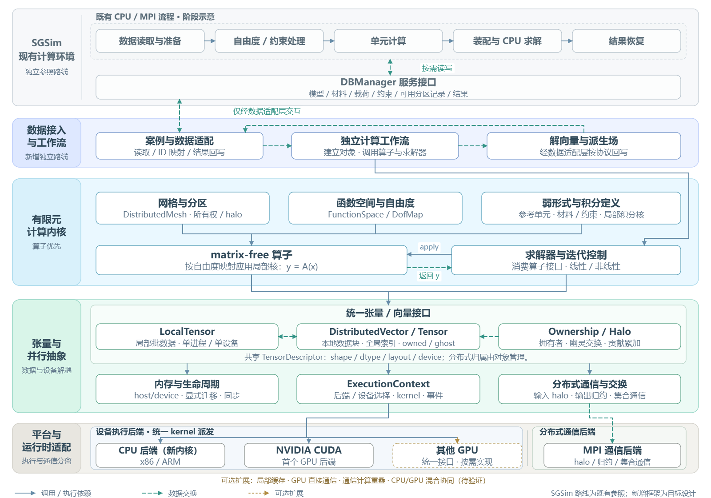
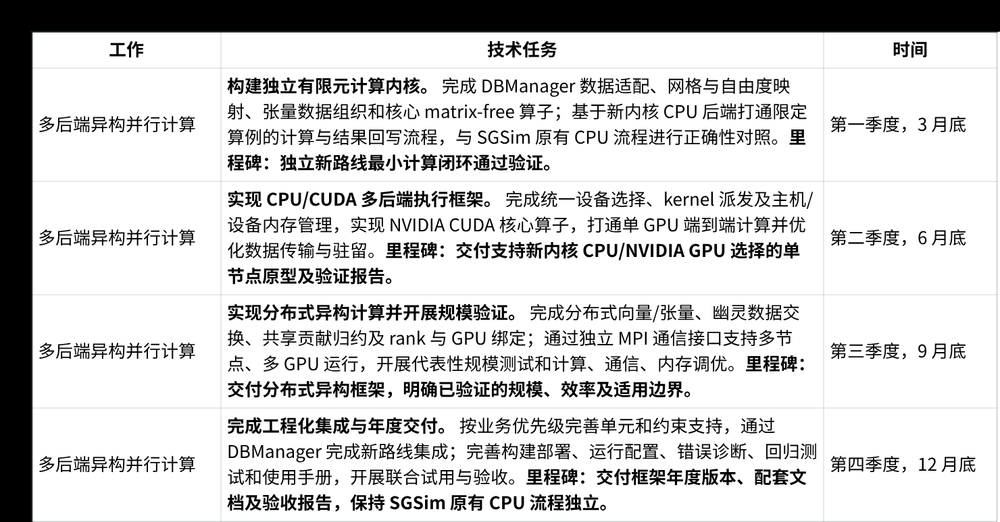

# HPC 研发规划

## 1.3.2 多后端异构并行计算

原文：参考MFEM的算子分解、运行时设备选择、kernel抽象和主机/设备内存管理思路，解耦有限元算法与 具体CPU、GPU及编程模型，撰写多后端异构并行框架实施方案；同步开展 matrix-free 方法研究及其 实现，为大规模问题的迭代求解提供不依赖显式矩阵组装的算子抽象。

改写：在不改变 SGSim 原有 CPU/MPI 计算路径的前提下，以 DBManager 作为数据服务边界，新增一条独立的有限元多后端异构计算路线。新路线通过数据适配层读取网格、材料、自由度、约束和分区信息，构建独立的分布式网格、函数空间、自由度映射和张量数据；有限元算法以 matrix-free 算子为计算主干，由求解器通过统一算子接口调用局部单元计算、贡献归约和分布式数据交换，从而减少对显式全局矩阵组装的依赖。运行时将设备执行后端与分布式通信后端分开：新内核 CPU 和 NVIDIA CUDA 共享统一的张量、kernel、执行上下文及主机/设备内存管理接口，MPI 专门负责 rank 间数据交换、同步和归约；其他 GPU 后端按照统一接口按需实现。通过上述分层，有限元算法、数据管理、具体 CPU/GPU 设备及编程模型相互解耦，同时保留 SGSim 原有 CPU 路径作为独立的兼容和结果对照路线。首期重点验证数据适配、张量布局、设备选择、主机/设备传输、局部算子执行、halo 交换和贡献归约的端到端正确性与性能，再根据验证结果推进后端扩展和生产集成。

- **A 结构与定位**：源文档 1.3.2 正文为改造 SGSim、按业务 / 抽象 / 实现 / 基础设施四层组织；本稿为不改动 SGSim、仅经 DBManager 另起独立内核，按 SGSim 参照 / 数据接入 / 计算内核 / 张量抽象 / 平台运行时五层组织。**疑问：本稿未说明新内核与 SGSim 原路径是逐步接管还是长期并存；若为并存，SGSim 现有代码不因此具备多后端能力，只有新内核重新实现的部分具备，待确认。**
- **B 缺少的说明**：一是**预条件子**——全稿未提及（源文档图·业务层 solver 框有「Krylov 方法 · 预处理接口」），而 matrix-free 只提供 $y = A(x)$、拿不到矩阵元素，AMG / ILU / BDDC 均需矩阵元素或局部未装配算子，新内核算例靠什么收敛无交代；二是 **matrix-free 本身**——只给出「以 matrix-free 算子为计算主干」「按自由度映射应用局部核」的提法，未说明算子的存储与重算如何划分，也未说明与 SGSim 现有直接法求解路径的关系。
- **C 本稿新增与细化的**：一是将设备执行后端与分布式通信后端分列为两个可独立选择的轴——源文档已把执行后端放在可插拔的实现层、MPI 放在基础设施层，但未给 MPI 对等的选择机制，「MPI + X」仍把二者绑为一体；分轴后后端组合由相乘变相加，排期与排错可固定一轴只变另一轴，通信实现可单独演进而不改 kernel。二是以 DBManager 为数据边界，并把 SGSim 现有五阶段流程画为独立参照路线。三是其他 GPU 后端改用虚线框标「统一接口 · 按需实现」。

## 1.5：27 年年度研发计划

拆分出具体的子任务、明确时间节点和里程碑；

| 工作 | 技术任务 | 时间 |
| --- | --- | --- |
| 多后端异构并行计算 | **构建独立有限元计算内核。** 完成 DBManager 数据适配、网格与自由度映射、张量数据组织和核心 matrix-free 算子；基于新内核 CPU 后端打通限定算例的计算与结果回写流程，与 SGSim 原有 CPU 流程进行正确性对照。**里程碑：独立新路线最小计算闭环通过验证。** | 第一季度，3 月底 |
| 多后端异构并行计算 | **实现 CPU/CUDA 多后端执行框架。** 完成统一设备选择、kernel 派发及主机/设备内存管理，实现 NVIDIA CUDA 核心算子，打通单 GPU 端到端计算并优化数据传输与驻留。**里程碑：交付支持新内核 CPU/NVIDIA GPU 选择的单节点原型及验证报告。** | 第二季度，6 月底 |
| 多后端异构并行计算 | **实现分布式异构计算并开展规模验证。** 完成分布式向量/张量、幽灵数据交换、共享贡献归约及 rank 与 GPU 绑定；通过独立 MPI 通信接口支持多节点、多 GPU 运行，开展代表性规模测试和计算、通信、内存调优。**里程碑：交付分布式异构框架，明确已验证的规模、效率及适用边界。** | 第三季度，9 月底 |
| 多后端异构并行计算 | **完成工程化集成与年度交付。** 按业务优先级完善单元和约束支持，通过 DBManager 完成新路线集成；完善构建部署、运行配置、错误诊断、回归测试和使用手册，开展联合试用与验收。**里程碑：交付框架年度版本、配套文档及验收报告，保持 SGSim 原有 CPU 流程独立。** | 第四季度，12 月底 |

## 2.2 多后端异构并行计算

### 2.2.1 研发目标（能力、产品）

在不改变 SGSim 原有 CPU/MPI 计算路径的前提下，依托 DBManager 的数据管理能力，增加一条独立的有限元多后端异构计算路线。新路线不沿用 SGSim 原有的单元计算、全局装配和求解调用链，而是通过数据适配层读取网格、材料、自由度、约束和分区信息，构建独立的有限元计算内核。

新内核以 matrix-free 算子为计算主干，通过统一算子接口组织局部单元计算、贡献归约和分布式数据交换；以张量和分布式向量为主要数据对象，解耦有限元算法与具体设备及编程模型。运行时将设备执行后端与分布式通信后端分开，首先实现新内核 CPU 和 NVIDIA CUDA 后端，其他 GPU 按统一接口按需实现，MPI 专门负责 rank 间交换、同步和归约。

本节目标包括：

1. 建立 DBManager 到新有限元内核的数据适配和结果回写契约。
2. 建立统一的张量、算子、kernel、执行上下文和主机/设备内存管理接口。
3. 完成限定单元和约束范围内的 CPU/CUDA 可切换计算闭环，并与 SGSim 原有 CPU 路径进行正确性对照。
4. 支持分区网格、owned/ghost 数据、MPI 通信和多 rank 与 GPU 绑定。
5. 形成可验证、可部署的异构并行框架、使用说明和适用边界。

### 2.2.2 实施计划（技术路线、现状、预期成果、里程碑、开发清单）

#### 2.2.2.1 技术路线

总体路线对应“多后端异构并行计算架构图”。SGSim 原有 CPU 流程作为独立参照路线保留；新路线仅通过 DBManager 数据服务接入。配图可在正式文档中单独插入。

新路线按以下顺序实施：

1. 数据接入与对象建立。 读取 `DBManager` 中的网格、材料、载荷、边界、自由度、约束和分区记录，完成全局/局部索引映射，构建 `DistributedMesh`、函数空间和 `DofMap`，明确所有权、ghost 和邻居关系。
2. 有限元内核与算子抽象。 将参考单元、几何映射、材料和积分规则组织为局部算子；由 `matrix-free` 算子实现 `y=A(x)`，求解器通过统一接口调用算子，不要求长期保存完整全局稀疏矩阵。
3. 张量与执行抽象。 用 `LocalTensor`、分布式向量/张量和张量描述符表达批数据、数据类型、布局、设备和所有权；由 `ExecutionContext` 负责后端选择、kernel 派发、事件同步、错误处理和内存预算。
4. 设备后端实现。 新内核 CPU 作为参考执行后端，NVIDIA CUDA 作为首个 GPU 后端。用户在启动时分别选择计算后端和设备编号；其他 GPU 按需实现，不将接口预留视为已具备可用能力。
5. 分布式通信。 MPI 作为独立通信后端，负责 halo 交换、共享自由度贡献归约和全局集合通信；首期采用主机缓冲通信，GPU-aware MPI、设备直接通信和通信计算重叠需经单独验证后再启用。
6. 结果验证与集成。 新路线的结果按全局 ID 和约定协议回写 `DBManager`，与 SGSim 原有 CPU 结果逐项对照；性能结论同时统计数据准备、传输、局部计算、归约和通信，不能只依据单个 kernel 耗时判断收益。

#### 2.2.2.2 现状

| 方向 | 当前状态 | 主要缺口 |
| --- | --- | --- |
| SGSim 原有 CPU/MPI 流程 | 已具备数据库、分区、自由度、单元计算、装配、求解和结果恢复路径 | 新路线的入口分流和数据适配接口尚需实现；原路径保持独立 |
| DBManager 数据服务 | 可作为模型、网格、分区和过程数据的统一访问边界 | 需确认批量读取、线程安全、预取、数据预存和结果回写契约 |
| 有限元单元计算 | 现有 SGFem/ElementCalculator 具备单元计算语义和结果契约，可作为新路线校核依据 | 现有接口偏逐对象调用，批量张量布局和异常单元处理尚未固化 |
| 多后端执行 | 已完成架构和原型方向梳理 | 新内核 CPU、NVIDIA CUDA、设备选择和内存运行时仍需工程实现 |
| matrix-free | 已确定为新内核的主要算子路线 | 算子、约束、通信和求解器接口需要原型验证 |
| MPI 与分区 | 已有 MPI 运行基础和分区语义 | 新路线需建立 owned/ghost、贡献归约及 rank/GPU 绑定契约 |

#### 2.2.2.3 预期成果

1. 多后端异构计算框架实施方案、接口说明和运行配置说明。
2. DBManager 数据适配、批数据契约及结果回写模块。
3. 新内核 CPU 参考后端和限定范围内的 matrix-free 算子。
4. NVIDIA CUDA 后端、设备选择、主机/设备内存管理和单节点 Demo。
5. MPI 分布式向量/张量通信、halo 交换、贡献归约及多 rank/GPU 验证结果。
6. 代表性算例的正确性、内存、传输、通信和端到端性能报告。
7. 框架使用手册、部署脚本、已验证支持列表和已知限制。

#### 2.2.2.4 开发清单

| 任务 | 优先级 | 责任方向 |
| --- | --- | --- |
| 数据适配、张量契约和结果回写 | P1 | 异构架构方向、数据库方向 |
| 新内核网格、自由度映射和 matrix-free 算子 | P1 | Bright（何亮）、数学/单元方向 |
| 统一执行上下文、后端选择和内存管理 | P1 | 异构架构方向、软件工程室 |
| NVIDIA CUDA 后端与单节点 Demo | P1 | Bright（何亮）、异构并行开发人员 |
| MPI 通信、owned/ghost 和 rank/GPU 绑定 | P1 | 杜阳、李宁宁、平台协作方向 |
| 规模验证、性能分析和回归测试 | P1 | 异构架构方向、测试团队、分区方向 |
| 其他 GPU 后端 | P2 | 根据实际需求按需实现 |

### 2.2.3 协调事项（人员、资源、协作需求）

1. 人员。 Bright（何亮）负责总体技术路线、算子契约和 `matrix-free`；杜阳负责 SGSim 接口、MPI 边界和环境协调；李宁宁负责跨方向协作、集成和交付组织；数据库、分区、单元和测试方向提供对应接口与验证支持。
2. 硬件与环境。 准备 NVIDIA GPU 开发机和多节点测试资源，明确型号、显存、驱动、CUDA、MPI 和网络拓扑。CPU 环境与 SGSim 原有依赖保持兼容；GPU 扩展采用可选构建和按需加载。统一使用 Intel MPI 2021.14，遵循本地编译、上传 `build` 产物、服务器加载环境运行的约定。
3. 数据。 提供代表性同构单元、复杂约束、混合结构和大规模网格数据及参考结果；大文件存放在 `/mnt` 挂载的 NAS，仓库只保存清单、配置和实验摘要。
4. 协作接口。 需要 `DBManager`、`Partition`、`ElementCalculator`、约束处理、结果恢复和求解器方向确认最小数据接口；分区优化与异构执行并行推进，但共享单元桶、接口规模和负载指标。

### 2.2.4 风险应对

| 风险 | 影响 | 应对措施 |
| --- | --- | --- |
| 新路线与 SGSim 原有调用链耦合 | 侵入 CPU 路径，回归范围扩大 | 通过数据适配层接入 `DBManager`，新旧计算流程分开；先用导出数据验证接口 |
| GPU 依赖影响 CPU 用户 | 原有环境无法构建或运行 | GPU 模块可选构建、按需加载；验证无 CUDA 环境下原 CPU 流程不变 |
| 数据准备和传输抵消 GPU 收益 | 端到端性能不达预期 | 统计读取、布局转换、传输、驻留、kernel、归约和通信全链路耗时 |
| 单元与约束差异导致批处理困难 | 支持范围受限、结果难以归因 | 先限定已验证组合并按计算签名分桶；不支持输入执行前诊断 |
| MPI 与设备数据不兼容 | 多 rank 运行失败或产生隐式拷贝 | 首期采用主机缓冲通信；设备直接通信和 GPU-aware MPI 单独验证 |
| 分区负载不均 | GPU 利用率低、通信开销高 | 与分区方向协作，记录单元桶、接口规模和 owned/ghost 负载指标 |
| 研究原型被误认为生产能力 | 交付承诺超出证据 | 区分原型、已验证后端和候选能力；每季度设置明确出口条件 |
| GPU 资源或人员不到位 | CUDA 验证延期 | 先完成接口、CPU 参考实现和数据契约；如实记录未完成项，不以 CPU 结果替代 GPU 验证 |

- **缺少的风险条目**：matrix-free 强制走迭代法，而现有基线为 CPardiso 直接法；2026-09-04 实测无预条件子时仅少数算例收敛、加 BDDC 后收敛仍不稳定、AMG 对复杂结构问题不适用，而 matrix-free 拿不到矩阵元素供 AMG / ILU / BDDC 使用，新内核可服务的算例范围因此无法确定。本节八行风险中无对应条目，**待确认**。
