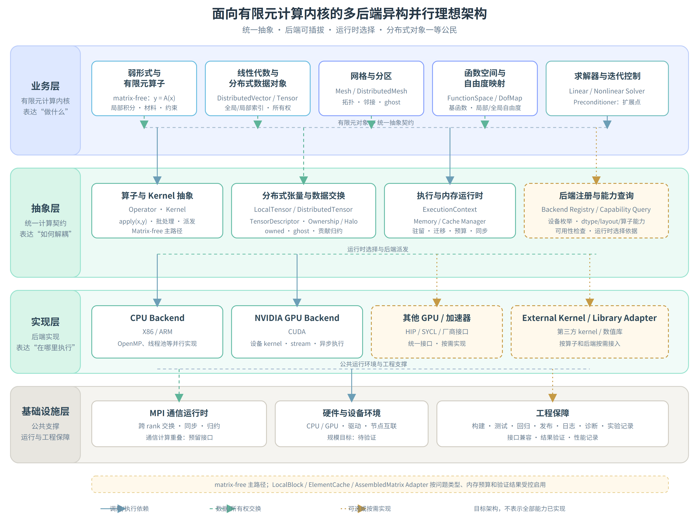

> 来源：`suanhaitech/houzai:docs/affairs/external_reports/2026_09_18_dalianligong_forth_biweekly/attachments/HPC 研发规划.md`（18.4 KB），2026-09-18 由 GitHub 账号 `ChaosTHL` 提交，是[第四次对外双周报](dut-fourth-biweekly-external-report.md)第 2.3 节的详细材料。**与同目录 [rd-plan-heterogeneous-sections-draft.md](rd-plan-heterogeneous-sections-draft.md) 不是同一稿**：本稿无「原文／改写」对照与点评，1.3.2 只留改写口径、2.2 全节展开，口径与本人写入飞书源文档的三节一致；本归档件是否直接导出自源文档未有依据，**作者待确认**。正文含人员实名责任分工与 NAS 存放约定，**经用户 2026-09-18 确认可公开后原样入仓**，未作改写；仅将随文图片改指 `media/rd-plan-heterogeneous-sections-final/fig-01.png`。落稿相对初稿的差异见 [my-tasks/biweekly-04/rd-plan-2026-2027-heterogeneous.md](../../my-tasks/biweekly-04/rd-plan-2026-2027-heterogeneous.md)。

# HPC 研发规划

# 1\.3\.2 多后端异构并行计算

**架构说明：**参考 MFEM 的算子分解、后端可插拔和运行时选择思想，面向大规模有限元计算构建由业务层、抽象层、实现层和基础设施层组成的多后端异构并行架构。业务层负责表达线性代数与分布式数据对象、网格与分区、函数空间与自由度、弱形式与有限元算子以及求解器与迭代控制；抽象层通过算子与 Kernel、分布式张量与数据交换、执行与内存运行时、后端注册与能力查询等统一契约，解耦有限元算法与具体硬件、编程模型和通信实现；实现层提供 X86/ARM CPU 后端和 NVIDIA CUDA 后端，OpenMP、线程池等作为 CPU 后端内部的并行实现方式，其他 GPU 或加速器通过 HIP、SYCL 或厂商接口按需接入，第三方 Kernel 和数值库通过适配器按算子和后端使用；基础设施层由 MPI 通信运行时、硬件与设备环境以及工程保障组成，其中 MPI 负责跨 rank 数据交换、同步和归约，不负责网格分区、数据所有权确定或局部 Kernel 执行。

有限元计算以 `matrix-free` 算子为主路径，求解器通过统一的 `Operator::apply(x,y)` 接口调用算子作用。算子根据网格、函数空间、自由度映射、材料、边界条件和积分规则，完成局部自由度提取、几何映射、数值积分、局部贡献生成和全局贡献归约；分布式对象通过 `Ownership/Halo` 管理 owned/ghost 数据、邻居关系和跨 rank 交换。对于不同单元类型、材料模型和内存条件，可按需采用在线重算、部分组装、积分点数据缓存、`LocalBlock`、`ElementCache` 或受控显式矩阵适配器；对适用的张量积单元，可进一步采用 sum factorization 优化算子计算，但不将其固化为所有问题的统一实现。

运行时通过 `Backend Registry / Capability Query` 枚举后端和设备，并根据算子、单元、数据类型、布局及设备能力创建 `ExecutionContext`。`Memory / Cache Manager` 负责主机与设备数据的驻留、迁移、缓存、内存预算和同步；选定后端后，由对应 CPU 或 GPU Kernel 执行局部计算。MPI 根据分布式对象提供的通信契约完成 halo 交换、共享自由度贡献归约和全局集合通信；通信计算重叠、GPU 直接通信和拓扑感知优化作为预留或可选扩展。

**实施策略：**

在不改变 SGSim 现有 CPU/MPI 计算流程及其调用链的前提下，保留原有流程作为稳定的兼容路线和结果对照基线。新增路线仅通过 `DBManager` 获取网格、材料、载荷、边界、自由度、约束和分区等数据，经数据适配层完成索引转换、结构校验和连续张量组织后，进入独立的有限元计算流程。新路线不复用 SGSim 原有的单元计算、全局装配和求解调用链，而是独立构建分布式网格、函数空间、自由度映射、`matrix-free` 算子、张量数据和求解控制。实施时先完成新内核 CPU 参考后端和限定算例的正确性闭环，再接入 NVIDIA CUDA 后端，逐步验证主机/设备数据传输、局部 Kernel 执行、`Ownership/Halo` 数据交换、共享自由度贡献归约及多 rank 运行；其他 GPU 或加速器后端按照统一接口，根据实际需求和验证结果按需实现。通过独立数据适配、算子抽象、执行运行时和后端实现，形成与 SGSim 原有 CPU 流程并列的异构并行计算路线，并依据正确性、内存占用、通信开销和端到端性能验证结果，逐步推进后端扩展和工程化集成。

---

# 1\.5：27 年年度研发计划

拆分出具体的子任务、明确时间节点和里程碑；

---

# **2\.2 多后端异构并行计算**

## **2\.2\.1 研发目标（能力、产品）**

在不改变 SGSim 原有 CPU/MPI 计算路径及其调用链的前提下，依托 `DBManager` 的数据管理能力，增加一条独立的有限元多后端异构计算路线。新路线不沿用 SGSim 原有的单元计算、全局装配和求解调用链，而是通过独立的数据适配层读取网格、材料、载荷、边界、自由度、约束和分区信息，构建新的有限元计算内核。SGSim 原有流程作为稳定的兼容路线和结果对照基线保留；本节所述四层架构是目标设计，2027 年计划按验证结果分阶段落地，并不表示所有目标模块在年初已经具备。

新内核优先采用 `matrix-free` 算子组织有限元计算，由求解器通过统一算子接口调用局部计算、贡献归约和分布式数据交换，并保留预条件子及受控显式矩阵适配接口。以本地张量、分布式向量与张量为主要数据对象，解耦有限元算法与具体设备及编程模型。先完成新内核 CPU 参考后端，再接入 NVIDIA CUDA；在新路线内部实现后端和设备选择，其他 GPU 或加速器按需扩展。设备执行与分布式通信职责分开，MPI 专门负责 rank 间交换、同步和归约。

本节目标包括：

1. 建立 `DBManager` 到新有限元内核的数据读取与适配契约，明确新路线的结果组织与导出方式；与现有结果管理流程的衔接按确认后的接口实施。

2. 建立算子与 Kernel、分布式张量与数据交换、执行与内存运行时、后端注册与能力查询的统一接口。

3. 完成限定单元、材料、载荷和约束组合内的 CPU/CUDA 可切换计算闭环，并与 SGSim 原有 CPU 路径进行正确性对照。

4. 建立并验证分区网格、owned/ghost 数据、MPI 通信以及多 rank 与 GPU 绑定机制。

5. 形成有验证证据、可按支持范围部署的异构并行框架、使用说明和适用边界。

---

## **2\.2\.2 实施计划（技术路线、现状、预期成果、里程碑、开发清单）**

### **2\.2\.2\.1 技术路线**

参考 MFEM 的算子分解、后端可插拔和运行时选择思想，总体设计采用业务层、抽象层、实现层和基础设施层。业务层表达线性代数与分布式对象、网格与分区、函数空间与自由度、弱形式与有限元算子、求解器与迭代控制；抽象层定义统一计算与数据契约；实现层提供设备后端及第三方 Kernel/数值库适配；基础设施层提供 MPI 通信运行时、硬件环境和工程保障。

理想架构表达模块职责，实际实施采用独立路线接入 SGSim：通过 `DBManager` 获取输入，在新内核中完成有限元计算，保留原有 CPU/MPI 流程及其调用链。新内核 CPU 后端与 SGSim 原有 CPU 流程是两条独立路线；后端选择作用于新内核，不把原有流程改造成新框架的 CPU 后端。

新路线按以下顺序实施：

1. **数据接入与对象建立。** 读取 \`DBManager\` 中的网格、材料、载荷、边界、自由度、约束和分区记录，完成全局/局部索引映射、结构校验和连续数据组织，构建 \`DistributedMesh\`、函数空间和 \`DofMap\`，明确所有权、ghost 和邻居关系；结果组织和导出接口单独定义，不预设必须回写 \`DBManager\`。

2. **有限元内核与算子抽象。** 根据网格、函数空间、自由度映射、材料、边界条件及积分规则构建算子。求解器通过 \`Operator::apply\(x,y\)\` 调用算子作用：更新输入 ghost 数据，提取局部自由度，执行几何映射、数值积分及局部计算，再累加局部贡献、归约共享自由度贡献并返回输出；约束变换与载荷处理按所选问题统一定义。优先采用 \`matrix\-free\`，减少对显式全局矩阵组装与存储的依赖。保留预条件子接入接口，首期按限定算例选配并验证求解收敛性；预条件子可使用独立的近似算子或矩阵。按验证结果选择在线重算、部分组装、积分点缓存、\`LocalBlock\` 或 \`ElementCache\`；受控显式矩阵为可选适配方式，sum factorization 仅用于适用的张量积单元。

3. **张量与执行抽象。** 用 \`LocalTensor\`、分布式向量/张量和张量描述符表达批数据、数据类型、布局、设备和所有权；通过后端注册与能力查询选择适用后端和设备，创建 \`ExecutionContext\` 组织 kernel 派发、事件同步和执行错误处理，由 \`Memory / Cache Manager\` 管理数据驻留、迁移、缓存及内存预算。

4. **设备后端实现。** 新内核 CPU 作为参考执行后端，NVIDIA CUDA 作为首个 GPU 后端，共享算子、张量和执行契约。用户在启动时选择后端和设备，能力查询检查算子、单元、数据类型及布局是否受支持，不支持的组合在执行前明确诊断。CPU 后端面向 X86/ARM，OpenMP、线程池等作为内部实现方式，年度支持范围以实际验证清单为准。其他 GPU 或加速器可通过 HIP、SYCL 或厂商接口按需实现；第三方 Kernel 和数值库通过适配器按算子及后端使用，不固定某个库为全部计算的统一实现。

5. **分布式通信。** 分布式网格、自由度及向量/张量对象通过 \`Ownership/Halo\` 定义所有权、ghost、邻居关系和交换规则，由 MPI 通信适配执行 halo 交换、共享自由度贡献归约和全局集合通信；执行运行时负责 rank/GPU 绑定。MPI 不负责网格分区、所有权划分或局部 Kernel 执行。首期采用主机缓冲通信，逐步验证多 rank、多 GPU 和多节点；GPU 直接通信、通信计算重叠和拓扑感知优化按硬件与验证结果选用。

6. **结果验证与集成。** 按全局 ID、自由度及物理量约定组织和导出新路线结果，与 SGSim 原有 CPU 结果逐项对照；与现有结果管理流程的衔接方式须经接口和数据结构确认，不预设结果回写 \`DBManager\`。性能结论同时统计数据准备、传输、局部计算、归约和通信，不能只依据单个 kernel 耗时判断收益。

---

### **2\.2\.2\.2 现状**

|方向|当前状态|主要缺口|
|---|---|---|
|SGSim 原有 CPU/MPI 流程|已具备数据库、分区、自由度、单元计算、装配、求解和结果恢复路径|新路线的独立入口和数据适配接口尚需实现；原路径保持独立|
|`DBManager` 数据服务|可作为模型、网格、分区和过程数据的统一访问边界|需确认批量读取、线程安全、预取、数据预存及新路线结果与现有结果管理流程的衔接接口|
|有限元单元计算|现有 `SGFem/ElementCalculator` 的计算语义和结果可作为新路线校核参考|需独立实现张量化局部计算、约束处理及结果组织，确认批数据布局与支持组合|
|多后端执行|已梳理四层目标架构和 CPU 优先、CUDA 随后的实施顺序|需实现并验证后端注册、能力查询、执行上下文、内存管理及 CPU/CUDA Kernel|
|`matrix-free` 与求解控制|已确定优先采用算子接口组织新内核计算|需验证算子作用、约束、预条件子接入、求解收敛及重算/缓存策略|
|MPI 与分区|SGSim 已有 MPI 运行基础和分区语义|新路线需独立建立分布式对象、owned/ghost、贡献归约及 rank/GPU 绑定机制，已有 MPI 流程不等于新内核已支持分布式执行|

---

### **2\.2\.2\.3 预期成果**

1. 与四层目标架构对应的实施方案、模块边界、数据/算子接口及运行配置说明。

2. `DBManager` 数据读取适配模块、索引与批数据契约、新路线结果组织与导出能力，以及经确认的结果衔接接口说明。

3. 新内核 CPU 参考实现、限定范围内的 `matrix-free` 算子与求解闭环，包含已验证的约束处理和预条件配置。

4. NVIDIA CUDA 后端和 CPU/CUDA 可选择的单节点原型，包含后端能力查询、执行上下文及主机/设备内存管理。

5. 分布式向量/张量、`Ownership/Halo` 与 MPI 通信适配，以及多 rank/GPU 和多节点验证原型及报告。

6. 代表性算例与回归清单，覆盖 SGSim 对照、新内核 CPU/CUDA 一致性、分布式正确性、内存、传输、通信及端到端性能；报告实际硬件、配置、验证规模和限制。

7. 年度候选版本、使用手册、构建部署材料、已验证支持列表、错误诊断说明及 SGSim 原有 CPU/MPI 路径兼容检查结果。

---

### **2\.2\.2\.4 开发清单**

|任务|优先级|责任方向|
|---|---|---|
|数据读取适配、张量契约、结果组织与导出及衔接接口确认|P1|异构架构方向、数据库方向|
|新内核网格、函数空间、自由度映射、约束及 `matrix-free` 算子|P1|Bright（何亮）、数学/单元方向|
|CPU 参考闭环、求解器与预条件子接口及收敛验证|P1|Bright（何亮）、数学/求解器方向|
|后端注册与能力查询、执行上下文、Kernel 派发及内存/缓存管理|P1|异构架构方向、软件工程室|
|NVIDIA CUDA 后端与单节点 Demo|P1|Bright（何亮）、异构并行开发人员|
|分布式对象、Ownership/Halo、MPI 通信适配及运行时 rank/GPU 绑定|P1|杜阳、李宁宁、平台协作方向|
|规模验证、性能分析和回归测试|P1|异构架构方向、测试团队、分区方向|
|构建部署、使用手册、诊断与 SGSim 原有流程兼容检查|P1|异构架构方向、软件工程室、测试团队|
|其他 GPU/加速器及高级通信优化|按需，不列为年度必达项|根据需求、资源和验证结果确定|

---

## **2\.2\.3 协调事项（人员、资源、协作需求）**

1. **人员。** Bright（何亮）负责总体技术路线、算子契约和 \`matrix\-free\`；杜阳负责 SGSim 数据接口、MPI 边界和环境协调；李宁宁负责跨方向协作、集成和交付组织。数据库、分区、单元、求解器和测试方向分别提供数据语义、分区信息、计算校核、收敛验证及回归支持；按季度确认接口交付和验证责任。

2. **硬件与环境。** 按单 GPU、多 GPU、多节点的验证顺序准备资源，记录 CPU/GPU 型号、内存/显存、编译器、驱动、CUDA、MPI 和网络拓扑。沿用当前会议约定的 Intel MPI 2021\.14 及本地编译、上传 \`build\` 产物、服务器加载环境运行的方式，验证构建与运行环境兼容性；如后续需调整依赖，单独验证并记录。GPU 模块采用可选构建和按需加载，检查无 CUDA 环境下 SGSim 原有 CPU/MPI 流程仍可运行；设备直接通信取决于实际 MPI 和硬件能力。

3. **数据与验收。** 第一季度共同确定首期单元、材料、载荷与约束组合、参考结果及误差/收敛判据，后续按业务优先级补充混合结构、复杂约束和规模算例。正确性同时参考解析解或可信基准（如具备）及 SGSim 结果，并记录两条路线的模型、边界、精度和求解容差。大文件存放在 \`/mnt\` 挂载的 NAS，仓库保存清单、配置和实验摘要；规模与效率结论以实测报告为准。

4. **协作接口。** 与 \`DBManager\` 和 \`Partition\` 方向确认数据服务覆盖范围、索引及自由度语义、分区信息、批量读取和线程访问约束；缺失数据明确来源及新内核构建规则。与 \`ElementCalculator\`、约束处理和求解器方向确认计算语义与校核口径，不通过其原有计算调用链执行新路线。结果组织、导出及与现有结果管理流程的衔接另行确认，不预设回写 \`DBManager\`。网格分区优化与异构执行解耦推进，共享负载、邻居规模和通信量指标。

---

## **2\.2\.4 风险应对**

|风险|影响|应对措施|
|---|---|---|
|工作量与交付风险|新路线不复用 SGSim 原有单元计算、装配和求解调用链，需要独立实现张量化单元计算、材料与约束处理、算子、求解衔接及结果组织，并完成 CPU/CUDA 和分布式验证。现有公式、计算语义和测试算例可作为参考，但直接代码复用范围需逐项评估。若首期同时要求全面覆盖 SGSim 既有功能并达到相当或更高效率，开发、校核和调优工作量可能显著超出年度资源，导致延期或交付范围不足。|第一季度建立单元、材料、载荷、约束与后端的支持清单，按代表性组合估算开发和验证工作量，明确年度必达项与后续扩展项。先完成限定算例的 CPU 参考闭环，再逐步扩展 CUDA 和分布式执行；为校核、调优、集成及回归预留资源。将原有路线的功能与性能回归要求和新路线的覆盖范围、精度及端到端性能目标分别验收。超出资源时调整新增支持范围与节点，不省略正确性验证。 |
|系统工程风险|新框架需同时管理有限元对象、算子接口、数据所有权、主机/设备内存、异步执行、MPI 通信和后端能力。接口边界不清、数据生命周期或同步规则不一致，可能造成错误结果、资源泄漏、通信阻塞及性能退化；过度抽象或对某个后端的隐性依赖也会增加维护成本，使原型难以演进为稳定、可扩展的系统。|明确四层职责及数据、算子、执行和通信契约，先以 CPU/CUDA 最小端到端原型验证接口，再依据真实扩展需求完善抽象。建立接口版本与兼容规则、模块责任、分层测试、持续集成、资源与错误诊断机制；覆盖单 rank、多 rank、CPU、GPU 及无 CUDA 环境。保持 SGSim 原有路线独立，GPU 依赖可选；新增后端先验证能力与接口兼容。以回归稳定性、故障定位能力和模块变更影响评估工程化成熟度，不以 Demo 可运行替代交付验收。|
|算法适用性与求解效率风险|接口可扩展不等于算法可直接适用于所有问题。不同单元、材料、约束及问题条件可能要求不同算子表达、积分策略和预条件方法；`matrix-free` 虽可减少全局矩阵存储，但不保证收敛、总内存下降或端到端加速。扩展复杂问题时，预条件构造、迭代次数、数据传输、分区负载和通信成本均可能限制收益，导致部分问题难以求解或性能不达目标。|按问题类别建立代表性验证集，分别验证离散与约束正确性、算子作用、预条件适配及求解收敛，再评估整体耗时与内存。保留可插拔预条件子、部分组装、局部缓存及受控显式矩阵适配，按问题选择，避免强制统一实现。对复杂问题先做算法可行性验证，再纳入支持清单；对照 CPU/CUDA 和不同 rank 数的结果，记录误差、残差、迭代次数、预处理成本、通信量及端到端性能，明确适用边界和不支持情况。|

