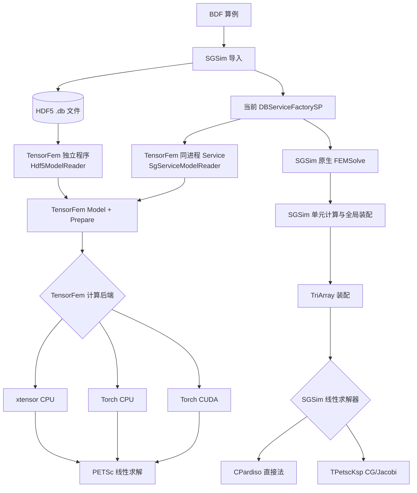

> 来源：`suanhaitech/houzai:docs/affairs/external_reports/2026_09_18_dalianligong_forth_biweekly/attachments/TensorFem多后端验证.md`（17.7 KB），2026-09-18 由 GitHub 账号 `ChaosTHL` 提交，是[第四次对外双周报](dut-fourth-biweekly-external-report.md)第 2.1 节的详细材料；文内未署作者，作者为宋维豪（算海），2026-09-18 经用户确认。正文含 `/home/peter/...` 本机路径、Docker 容器名与完整 CMake 构建参数，**经用户 2026-09-18 确认可公开后原样入仓**，未作改写或脱敏。

# TensorFem 多后端验证

## 1. 总体架构



当前验证包含三条求解路径：

1. **SGSim 直接法**：采用 CPardiso；
2. **SGSim 迭代法**：采用 TPetscKsp CG/Jacobi；
3. **TensorFem 路径**：采用 PETSc 线性求解，并支持 xtensor CPU、Torch CPU 和 Torch CUDA 三种计算后端。

其中，TensorFem 支持两种数据输入方式：

```text
与数据库交互
当前 DBServiceFactorySP
→ SgServiceModelReader
→ Model
→ Prepare
→ Backend
→ PETSc

与 DB 文件交互
.db
→ Hdf5ModelReader
→ Model
→ Prepare
→ Backend
→ PETSc
```

两种数据入口从 Model 之后共用 Prepare、Backend、PETSc 和结果恢复代码。也就是说，TensorFem 的“数据入口”和“计算后端”是两个不同维度：前者决定数据如何进入 TensorFem，后者决定 TensorFem 内部采用 xtensor CPU、Torch CPU 或 Torch CUDA 进行计算。当前 torch-cuda 只表示 TensorFem 张量计算使用 CUDA；PETSc 矩阵、向量和 CG/Jacobi 仍在 CPU。

## 2. 编译、后端切换与运行

### 2.1 编译依赖

本轮实际环境如下：

| 依赖 | 当前环境 |
|---|---|
| 操作系统 | Ubuntu 22.04 |
| GCC/G++ | 11.4 |
| CMake | 3.22.1 |
| C++ 标准 | C++17 |
| xtensor | 0.25.0 |
| LibTorch | 2.7.1，含 CUDA |
| CUDA Toolkit | 12.0 |
| PETSc | 3.22.1，complex double，64-bit indices |
| HDF5 / Parallel HDF5 | 1.14.5 |
| oneMKL | 2025.0 |
| SGSim | SGFEM-tb-u22，运行日志报告 DLUTFEM 0.7.4 |
| GPU | NVIDIA GeForce RTX 4060 Laptop GPU，计算能力 8.9 |

### 2.2 当前构建配置

/tmp/tensorfem-gpu-build/CMakeCache.txt 确认当前构建为 Release，并启用 xtensor、MKL Batch、Torch CPU/CUDA、独立程序和测试。与当前缓存一致的配置命令为：

```bash
cmake -S /home/peter/repositories/SGSim/TensorFem \
  -B /tmp/tensorfem-gpu-build \
  -DCMAKE_BUILD_TYPE=Release \
  -DCMAKE_C_COMPILER=/usr/bin/gcc-11 \
  -DCMAKE_CXX_COMPILER=/usr/bin/g++-11 \
  -DCMAKE_PREFIX_PATH='/home/peter/opt/openfinite4-deps/usr;/home/peter/fealpytest/lib/python3.12/site-packages/torch/share/cmake' \
  -DTENSORFEM_ENABLE_TORCH=ON \
  -DTENSORFEM_ENABLE_MKL_BATCH=ON \
  -DTENSORFEM_MKL_ROOT=/opt/intel/oneapi/mkl/2025.0 \
  -DTENSORFEM_PETSC_DIR=/tmp/petsc-sgsim-complex \
  -DTENSORFEM_BUILD_APPLICATION=ON \
  -DTENSORFEM_BUILD_TESTS=ON \
  -DTENSORFEM_BUILD_SGSIM_SERVICE_DEMO=OFF \
  -DTENSORFEM_SGSIM_ROOT=/home/peter/repositories/SGSim \
  -DTENSORFEM_SGSIM_ARTIFACT=/home/peter/repositories/SGSim/Artifact/Ubuntu22-gcc11.4 \
  -DTENSORFEM_SGSIM_BUILD=/home/peter/repositories/SGSim/build/debug \
  -DCUDAToolkit_ROOT=/tmp/cuda-toolkit \
  -DCMAKE_CUDA_ARCHITECTURES=89
```

TENSORFEM_SGSIM_BUILD 指向 build/debug，是为了取得 SGSim 已生成的 Utility/Config.h。本轮运行时动态库搜索顺序仍以 Artifact/Ubuntu22-gcc11.4/lib 为先，实际性能数据没有加载 SGSim Debug 动态库。

本轮增加入口计时日志后，实际执行的增量编译命令为：

```bash
docker exec sgsim-tensorfem-gpu \
  cmake --build /tmp/tensorfem-gpu-build -j 4
```

生成的主要文件为：

```text
/tmp/tensorfem-gpu-build/libTensorFem.so
/tmp/tensorfem-gpu-build/TensorFem
```

### 2.3 后端切换入口

当前对外暴露三个组合选项：

| 选项 | Tensor Backend | Device |
|---|---|---|
| xtensor-cpu | xtensor | CPU |
| torch-cpu | Torch | CPU |
| torch-cuda | Torch | CUDA |

Backend 与 Device 尚未作为两个独立参数暴露，当前通过上述组合名称选择执行方式。

独立 .db 程序通过第三个位置参数选择后端：

```bash
TensorFem <input.db> <output.h5> xtensor-cpu -ksp_rtol <rtol> -ksp_atol <atol>
TensorFem <input.db> <output.h5> torch-cpu   -ksp_rtol <rtol> -ksp_atol <atol>
TensorFem <input.db> <output.h5> torch-cuda  -ksp_rtol <rtol> -ksp_atol <atol>
```

TensorFem 与数据库交互时，通过 SGFEM 的 -tb 或 --tb 选择计算后端：

```bash
SGFEM -i model.bdf -w output -j model --tb xtensor-cpu -ksp_rtol 1e-12 -ksp_atol 1e-50
SGFEM -i model.bdf -w output -j model --tb torch-cpu -ksp_rtol 1e-12 -ksp_atol 1e-50
SGFEM -i model.bdf -w output -j model --tb torch-cuda -ksp_rtol 1e-12 -ksp_atol 1e-50
```

命令行接受 OFF、xtensor-cpu、torch-cpu 和 torch-cuda。命令行值优先于配置文件中的 TensorFem.Backend；未提供 -tb/--tb 时，配置值作为回退。

本轮与数据库交互测试故意把配置中的 Backend 设置为 OFF，再通过 --tb 选择三种后端。结果文件记录的 BACKEND 和 DEVICE 与命令一致，证明后端由命令行成功切换。

当前同一个 TensorFem 动态库同时包含三种后端，因此切换后端不需要重新编译。

### 2.4 SGSim 原生路径

SGSim 直接法的 model.conf 选择：

```json
{
  "Solver": {
    "LinearReal": {
      "Value": "CPardiso<Real_t>"
    }
  },
  "TensorFem": {
    "Backend": "OFF"
  }
}
```

SGSim 迭代法选择 TPetscKsp<Real_t>。当前源码已在求解器路径内设置 CG、Jacobi 和最大迭代次数默认值，命令行只需传入收敛容差：

```bash
-ksp_rtol 1e-12 \
-ksp_atol 1e-50
```

两条原生路径均使用 /gpu-output/bin/SGFEM-tb-u22 和相同的中型 TET 输入。本轮表 3.4 中的原生迭代法数据产生于该简化之前，当时还显式传入 -ksp_type cg、-pc_type jacobi 和 -ksp_max_it 10000；有效求解配置与现在的代码默认值相同。

TensorFem 已重新编译并完成两条入口的运行验证。SGSim Algebra 源码已同步设置 CG/Jacobi 默认值，但当前 SGSim 构建缓存使用 g++ 却传入 Intel -qopenmp 选项，因此新 SGSim 原生迭代二进制的编译和运行验证尚未完成。

### 2.5 与数据库交互配置与命令

本轮与数据库交互算例的 model.conf 使用以下结构：

```json
{
  "TensorFem": {
    "Backend": "OFF",
    "Library": "/tmp/tensorfem-gpu-build/libTensorFem.so",
    "Output": "<本次输出目录>/result.h5"
  }
}
```

三种后端实际调用形式为：

```bash
/gpu-output/bin/SGFEM-tb-u22 \
  -i <运行目录>/input/model.bdf \
  -w <运行目录>/output \
  -j model \
  --tb xtensor-cpu \
  -ksp_rtol 1e-12 \
  -ksp_atol 1e-50
```

```bash
/gpu-output/bin/SGFEM-tb-u22 \
  -i <运行目录>/input/model.bdf \
  -w <运行目录>/output \
  -j model \
  --tb torch-cpu \
  -ksp_rtol 1e-12 \
  -ksp_atol 1e-50
```

```bash
/gpu-output/bin/SGFEM-tb-u22 \
  -i <运行目录>/input/model.bdf \
  -w <运行目录>/output \
  -j model \
  --tb torch-cuda \
  -ksp_rtol 1e-12 \
  -ksp_atol 1e-50
```

其中 <运行目录> 对应：

```text
/gpu-output/tetra4_minimal_verify_20260918/xtensor-cpu/run_N
/gpu-output/tetra4_minimal_verify_20260918/torch-cpu/run_N
/gpu-output/tetra4_minimal_verify_20260918/torch-cuda/run_N
```

N 为 1、2、3。

### 2.6 与 DB 文件交互命令

与 DB 文件交互时，TensorFem 独立读取本轮 SGSim 直接法生成并包含参考结果的数据库：

```text
/gpu-output/tetra4_minimal_verify_20260918/sgsim-direct/run_1/output/model.db
```

三种实际命令为：

```bash
/tmp/tensorfem-gpu-build/TensorFem \
  /gpu-output/tetra4_minimal_verify_20260918/sgsim-direct/run_1/output/model.db \
  /gpu-output/tetra4_minimal_verify_20260918/hdf5-xtensor-cpu/run_1/result.h5 \
  xtensor-cpu \
  -ksp_rtol 1e-12 \
  -ksp_atol 1e-50
```

```bash
/tmp/tensorfem-gpu-build/TensorFem \
  /gpu-output/tetra4_minimal_verify_20260918/sgsim-direct/run_1/output/model.db \
  /gpu-output/tetra4_minimal_verify_20260918/hdf5-torch-cpu/run_1/result.h5 \
  torch-cpu \
  -ksp_rtol 1e-12 \
  -ksp_atol 1e-50
```

```bash
/tmp/tensorfem-gpu-build/TensorFem \
  /gpu-output/tetra4_minimal_verify_20260918/sgsim-direct/run_1/output/model.db \
  /gpu-output/tetra4_minimal_verify_20260918/hdf5-torch-cuda/run_1/result.h5 \
  torch-cuda \
  -ksp_rtol 1e-12 \
  -ksp_atol 1e-50
```

run_2 和 run_3 只改变输出目录。本轮与 DB 文件交互时还会读取 .db 中的 SGSim 参考结果并执行内置正确性比较。

### 2.7 最终容差接口复测

2026-09-18 使用 torch-cpu 分别复测 Service 与独立 .db 入口，两条命令都只附加：

```bash
-ksp_rtol 1e-12 -ksp_atol 1e-50
```

两条路径均正常结束，结果文件均记录 KSP_RTOL=1e-12、KSP_ATOL=1e-50、KSP_ITERATIONS=556、KSP_RESIDUAL_NORM=2.2800e-17。Service 与独立 .db 的位移、反力和 TET 质心应力逐值完全相同。

重新以 SGSim CPardiso 直接法为基准逐项计算后，两条路径均得到：位移最大绝对误差 1.329e-16、相对 L2 1.584e-12；反力最大绝对误差 5.329e-13、相对 L2 2.074e-12；应力最大绝对误差 4.047e-12、相对 L2 5.377e-13。该结果与表 3.2 的 Torch CPU 行一致。

### 2.8 CUDA 设备确认

运行前可执行：

```bash
nvidia-smi
```

本轮结果元数据确认 torch-cuda 使用 DEVICE=cuda:0。PETSc 元数据仍为 MATSEQAIJ 和 VECSEQ，线性求解设备为 CPU。

## 3. 本轮验证结果

以下结果按实际运行项展开。表格中的 `Service` 表示 TensorFem **与数据库交互**的数据入口，`独立 .db` 表示 TensorFem **与 DB 文件交互**的数据入口；二者都属于同一条 TensorFem 求解路径，只是数据输入方式不同。


### 3.1 验证条件

- 算例：rectangular_solid_medium_tet_pressure_sgsim.bdf；
- GRID：18,081；
- CTETRA4：96,000；
- PLOAD4：800；
- SPC：441；
- 单 MPI 进程；
- OMP_NUM_THREADS=1；
- MKL_NUM_THREADS=1；
- SGSim Artifact Release 动态库优先；
- 每条路径运行 3 次；
- KSP 收敛参数：-ksp_rtol=1e-12、-ksp_atol=1e-50；
- 本轮共执行 24 次正式求解，全部退出状态 0。

### 3.2 最终结果正确性

以 SGSim CPardiso 直接法为基准。下表取每条路径三次运行中的最大误差和相对 L2 差异。

| 路径 | 位移最大绝对误差 | 位移相对 L2 | 反力最大绝对误差 | 反力相对 L2 | 应力最大绝对误差 | 应力相对 L2 |
|---|---:|---:|---:|---:|---:|---:|
| SGSim iterative | 6.118e-17 | 5.018e-13 | 2.000e-13 | 4.524e-13 | 1.462e-12 | 3.651e-13 |
| Service + xtensor CPU | 1.329e-16 | 1.584e-12 | 5.329e-13 | 2.074e-12 | 4.047e-12 | 5.377e-13 |
| Service + Torch CPU | 1.329e-16 | 1.584e-12 | 5.329e-13 | 2.074e-12 | 4.047e-12 | 5.377e-13 |
| Service + Torch CUDA | 1.331e-16 | 1.586e-12 | 5.357e-13 | 2.079e-12 | 4.050e-12 | 5.386e-13 |
| 独立 .db + xtensor CPU | 1.329e-16 | 1.584e-12 | 5.329e-13 | 2.074e-12 | 4.047e-12 | 5.377e-13 |
| 独立 .db + Torch CPU | 1.329e-16 | 1.584e-12 | 5.329e-13 | 2.074e-12 | 4.047e-12 | 5.377e-13 |
| 独立 .db + Torch CUDA | 1.330e-16 | 1.588e-12 | 5.337e-13 | 2.079e-12 | 4.060e-12 | 5.384e-13 |

其中 Service + Torch CPU 与独立 .db + Torch CPU 已在简化参数代码重新编译后，使用 -ksp_rtol 1e-12、-ksp_atol 1e-50 单独复测，重新计算结果与表中数值一致。

每次比较覆盖：

- 18,081 个节点的三分量位移；
- 18,081 个节点的三分量约束反力；
- 96,000 个 CTETRA4 质心的六分量应力。

表中的相对 L2 是相对于 SGSim CPardiso 参考结果的普通向量相对差异，不是预条件残差。1.584e-12 大于 1e-12，因此当前结果只能表述为处于 10^-12 数量级，不能表述为严格小于 1e-12。KSP 的 -ksp_rtol=1e-12 是预条件残差收敛参数，不能直接作为最终位移、反力或应力相对误差的验收阈值。

### 3.3 后端和求解器确认

以下为各路径第 1 次运行的代表性元数据：

| 路径 | BACKEND | DEVICE | KSP 迭代 | KSP 残差 |
|---|---|---|---:|---:|
| Service + xtensor CPU | xtensor-cpu | cpu | 556 | 2.280e-17 |
| Service + Torch CPU | torch-cpu | cpu | 556 | 2.280e-17 |
| Service + Torch CUDA | torch-cuda | cuda:0 | 556 | 2.288e-17 |
| 独立 .db + xtensor CPU | xtensor-cpu | cpu | 556 | 2.280e-17 |
| 独立 .db + Torch CPU | torch-cpu | cpu | 556 | 2.280e-17 |
| 独立 .db + Torch CUDA | torch-cuda | cuda:0 | 556 | 2.283e-17 |

KSP 的 -ksp_rtol=1e-12 是线性方程残差收敛条件；-ksp_atol=1e-50 是绝对残差门限。位移、反力和应力误差还包含装配累加顺序、条件数和后处理差异，其数量级不要求与 rtol 相同。

### 3.4 运行时间

| 路径 | 3 次墙钟时间/s | 平均/s | 标准差/s |
|---|---|---:|---:|
| SGSim CPardiso 直接法 | 5.873 / 5.795 / 5.801 | 5.823 | 0.035 |
| SGSim TPetscKsp CG/Jacobi | 5.992 / 6.005 / 5.978 | 5.992 | 0.011 |
| Service + xtensor CPU | 7.470 / 7.234 / 7.306 | 7.336 | 0.099 |
| Service + Torch CPU | 6.086 / 6.079 / 6.055 | 6.074 | 0.013 |
| Service + Torch CUDA | 6.274 / 6.141 / 6.142 | 6.186 | 0.063 |
| 独立 .db + xtensor CPU | 8.201 / 8.094 / 8.149 | 8.148 | 0.044 |
| 独立 .db + Torch CPU | 7.021 / 6.900 / 6.885 | 6.935 | 0.061 |
| 独立 .db + Torch CUDA | 7.088 / 7.030 / 7.031 | 7.050 | 0.027 |

本轮相同环境中，SGSim 直接法平均最快。TensorFem 中 Torch CPU 快于 xtensor CPU；Torch CUDA 与 Torch CPU 接近，没有形成加速，原因之一是 PETSc KSP 仍在 CPU。

### 3.5 TensorFem 分阶段时间

| 路径 | Reader/s | Prepare/s | Analysis/s | KSP/s | 参考比较/s | 写出/s |
|---|---:|---:|---:|---:|---:|---:|
| Service + xtensor CPU | 0.053 | 0.143 | 5.942 | 2.788 | — | — |
| Service + Torch CPU | 0.052 | 0.145 | 4.691 | 2.790 | — | — |
| Service + Torch CUDA | 0.051 | 0.145 | 4.721 | 2.794 | — | — |
| 独立 .db + xtensor CPU | 0.746 | 0.142 | 5.863 | 2.761 | 0.757 | 0.003 |
| 独立 .db + Torch CPU | 0.769 | 0.142 | 4.617 | 2.725 | 0.764 | 0.003 |
| 独立 .db + Torch CUDA | 0.744 | 0.142 | 4.678 | 2.750 | 0.769 | 0.003 |

Analysis 包含后端计算、装配、KSP 和结果恢复；KSP 是 Analysis 的子阶段，不能与 Analysis 相加。

## 4. Service 与 .db 的时间差

相同 torch-cpu 后端下：

| 阶段 | Service | 独立 .db | 差值 |
|---|---:|---:|---:|
| Reader | 0.052 s | 0.769 s | +0.717 s |
| Prepare | 0.145 s | 0.142 s | -0.003 s |
| Analysis | 4.691 s | 4.617 s | -0.074 s |
| 参考读取与比较 | 不执行 | 0.764 s | +0.764 s |

差异集中在数据入口和独立程序附加校验，后续 Prepare 与 Analysis 基本一致。

Hdf5ModelReader::read() 在读取前后各计算一次整个 .db 的 SHA-256，用于确认文件在读取过程中没有变化。本轮约 94.8 MB 数据库的单次 SHA-256 为 0.290、0.270、0.274 s，平均 0.278 s；两次约 0.556 s，占 HDF5 Reader 时间约 72.3%。

SgServiceModelReader 直接接收当前进程已有的 DBServiceFactorySP，并将来源标记为 DBSERVICE-LIVE-SESSION，不对磁盘 .db 做两次完整哈希。

因此，Service 路径更短的主要原因是：

1. 直接使用活动的 Service/DBManager 对象；
2. 不执行两次全文件 SHA-256；
3. 不执行独立程序的参考结果读取与比较。

本轮没有继续拆分 HDF5 dataset 读取、DBManager CachePool 和操作系统页缓存的精确贡献。

## 5. 当前实现边界

| 项目 | 当前实现或本轮验证情况 |
|---|---|
| MPI | TensorFem 当前验证为单进程 |
| SOL | SOL 101 |
| Element | CHEXA8、CTETRA4；本轮验证 CTETRA4 |
| Material | MAT1 各向同性材料 |
| Property | PSOLID |
| Load | 本轮验证 PLOAD4 |
| Constraint | SPC 平移自由度 |
| Coordinate System | 本轮为基本坐标系 |
| instance/subcase | 当前入口使用 instance 1、subcase 1 |
| Tensor Backend | xtensor CPU、Torch CPU、Torch CUDA |
| Tensor 数值类型 | Float64 |
| PETSc | complex double，64-bit indices |
| Linear Solver | KSPCG + PCJACOBI；最大迭代次数默认 10000 |
| Solver CLI | 仅需 -ksp_rtol 与 -ksp_atol |
| Linear Solver Device | CPU |
| CUDA 覆盖 | Torch 张量计算；PETSc 仍在 CPU |
| 中间数组一致性 | 未逐项比较；已验证最终结果 |
| 内存 | 本轮未调整，也不作为验收指标 |

本轮代码调整后，prepare、hexa8、tetra4 和 result_comparison 四项单元测试全部通过。7 个依赖固定历史数据库路径的集成测试因参考文件已不存在而无法启动；本轮 24 次真实求解及结果比较均成功。

## 6. 结论与证据

本轮验证支持以下结论：

1. SGSim 直接法、SGSim 迭代法、Service 三种后端和独立 .db 三种后端均完成真实 TET 求解；
2. --tb 可以在同一构建产物上运行时切换 xtensor CPU、Torch CPU 和 Torch CUDA；
3. 三种 TensorFem 后端在两种数据入口下均已计算与 SGSim 直接法的位移、反力和应力差异，结果见表 3.2；
4. Service 与 .db 的后续计算时间接近，主要差异来自 HDF5 Reader 的双 SHA-256 和独立参考比较；
5. Torch CUDA 当前不是全 GPU 求解，中型 TET 上未快于 Torch CPU；
6. TensorFem 的简化求解参数接口已在 Service 和独立 .db 两条入口验证，CG/Jacobi 与最大迭代次数由代码提供默认值。

本轮汇总报告：

```text
/home/peter/Desktop/数据库分区/tensorfem_gpu_test/tetra4_minimal_verify_20260918/验证结果.md
```

原始运行目录：

```text
/home/peter/Desktop/数据库分区/tensorfem_gpu_test/tetra4_minimal_verify_20260918/
```

上述原始运行目录保存 8 条路径各 3 次运行的 timing.txt、stdout.log、stage_timing.txt 和结果 HDF5 文件。

最终容差接口复测目录：

```text
/home/peter/Desktop/数据库分区/tensorfem_gpu_test/tetra4_ksp_final_20260918/
```
