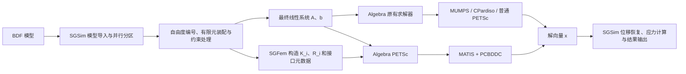

# 预条件器接入设计与测试

> 来源：胡凯（算海），2026-09-02。原文照录归档，未作改写。

## 一、接入架构设计（待修改）与数学定义

### 1.1 求解模块接入

SGSim 继续通过 Algebra 的 `TLinearSolver` 工厂创建现有求解器。配置选择 PETSc + BDDC 时，SGFem 在有限元装配阶段保留当前 rank 的单元刚度贡献，并在总体矩阵装配完成后构造 BDDC 子域数据。

普通求解路径只接收 $A$ 和 $b$。BDDC 路径额外接收不依赖 SGFem 具体类型的子域数据对象，其内容包括局部算子 $K_i$、局部—全局映射 $R_i$、局部 Dirichlet 自由度、Primal 候选和近零空间。

### 1.2 局部子域算子

SGSim 处理约束前的线性静力方程为

$$
Ku=f.
$$

单点约束、多点约束、刚性连接和运行时生成约束统一表示为

$$
u=Tq+u_0.
$$

$q$ 为约束处理后保留的独立未知量，$T$ 为独立未知量到物理自由度的延拓关系。最终线性系统为

$$
Aq=b,
\qquad
A=T^{\mathsf T}KT.
$$

直接法只需要最终系统 $Aq=b$。BDDC 还需要各进程的局部未装配算子。SGFem 在当前进程的物理自由度空间中汇总单元贡献：

$$
\widehat K_i=
\sum_{e\in\Omega_i}L_e^{\mathsf T}K_eL_e,
$$

再应用当前子域的约束变换：

$$
K_i=T_i^{\mathsf T}\widehat K_iT_i.
$$

$K_i$ 是第 $i$ 个子域在最终独立方程空间中的局部矩阵。设 $R_i$ 为局部方程到全局方程的映射，局部数据必须满足

$$
A=\sum_iR_i^{\mathsf T}K_iR_i.
$$

数据通路包括：

- 从分区数据库读取当前进程的单元、节点连接和活动物理自由度；
- 在有限元装配阶段记录当前进程的单元刚度贡献；
- 查询独立、固定、多点约束和刚性连接从属自由度在最终方程空间中的展开；
- 构造约束前局部矩阵、约束变换、约束后局部矩阵和局部—全局映射；

### 1.3 BDDC结构数据

SGFem 构造以下 BDDC 结构数据：

- 由物理单元连接和实际刚度非零耦合共同确定的局部邻接图；
- 平移、转动和未分类未知量对应的自由度字段；
- 局部刚度连通分量标识；
- 与并行接口相交的连通分量上的几何角点候选；
- 三个平移和三个转动结构候选模式；
- 局部方程到全局最终方程的映射。

Algebra 使用这些数据构造 MATIS，并在 PETSc setup 阶段建立接口拓扑、局部 Dirichlet/Neumann 求解器、deluxe scaling 和粗空间。Krylov 方法使用 SGSim 最终总体矩阵 $A$ 完成矩阵向量乘，MATIS 作为 PCBDDC 的预条件算子：

$$
\operatorname{Amat}=A,
\qquad
\operatorname{Pmat}=A_{\mathrm{MATIS}}.
$$

## 二、验证结果

测试环境为 Ubuntu 22.04、2路 Intel Xeon Gold 5118、24个物理核心、62 GiB内存和 Intel MPI 2021.18.1；PETSc、MUMPS 和 HYPRE 版本分别为3.22.1、5.7.3和3.1.0。

| 状态 | 判据 |
| --- | --- |
| 运行完成 | 完成装配、求解、结果恢复和导出，退出码为0 |
| 相对残差达标 | 使用原总体矩阵计算的 $\lVert b-Ax\rVert_2/\lVert b\rVert_2\le10^{-8}$ |
| 后向稳定 | 显式相对残差未达到 $10^{-8}$，无穷范数后向误差接近机器精度 |

### 2.1 最终矩阵性质

14 个最终矩阵的数值均为实数。数值 Hermitian 误差采用

$$
\varepsilon_H=
\frac{\lVert A-A^*\rVert_F}{\lVert A\rVert_F}
$$

计算，并以 $10^{-12}$ 为判据。正定性通过实数 MUMPS 对

$$
H=\frac{A+A^*}{2}
$$

执行对称不定分解并统计惯性。

结果表明：

- 12 个最终矩阵满足统一的数值对称正定判据；
- `50w-2d-pload` 和 `Pshell_17w_cquad4_Pload2` 的 Hermitian 部分正定，但原矩阵的数值非对称误差超过 $10^{-12}$，不满足 CG 的适用前提；
- `50w-2d` 满足当前数值对称判据，但误差接近判据上限；

| 算例                          | MPI |     最终方程数 |       $\varepsilon_H$ | 惯性 $(n_-,n_0,n_+)$ | 判定                                   |
| --------------------------- | --: | --------: | --------------------: | -----------------: | ------------------------------------ |
| `10w-3d`                    |  16 |   129,591 | $8.535\times10^{-17}$ |     $(0,0,129591)$ | 数值对称正定                               |
| `10w-3d-mpc-1st`            |  16 |   143,064 | $8.704\times10^{-17}$ |     $(0,0,143064)$ | 数值对称正定                               |
| `10w-mix013d`               |  16 |   129,591 | $9.726\times10^{-18}$ |     $(0,0,129591)$ | 数值对称正定                               |
| `10w-mix12d-mpcnested`      |  16 |    98,604 | $5.956\times10^{-17}$ |      $(0,0,98604)$ | 数值对称正定                               |
| `50w-mix02d-allrbe2`        |  16 |     3,738 | $6.679\times10^{-16}$ |       $(0,0,3738)$ | 数值对称正定                               |
| `50w-2d-allF_M_P`           |  32 |   570,672 | $1.054\times10^{-16}$ |     $(0,0,570672)$ | 数值对称正定                               |
| `50w-2d`                    |  32 |   454,704 | $6.391\times10^{-13}$ |     $(0,0,454704)$ | 数值对称正定，接近判据上限                        |
| `50w-2d-pload`              |  32 |   454,704 | $7.018\times10^{-12}$ |     $(0,0,454704)$ | Hermitian 部分正定；原矩阵不满足数值 Hermitian 判据 |
| `50w-mix23d`                |  32 |   506,127 | $8.440\times10^{-17}$ |     $(0,0,506127)$ | 数值对称正定                               |
| `100w-mix23d-rbe`           |  32 | 1,085,871 | $8.272\times10^{-17}$ |    $(0,0,1085871)$ | 数值对称正定                               |
| `100w-mix23d`               |  32 | 1,085,955 | $8.276\times10^{-17}$ |    $(0,0,1085955)$ | 数值对称正定                               |
| `Pshear_17w_cquad4_Pload2`  |  32 | 1,003,536 | $1.593\times10^{-17}$ |    $(0,0,1003536)$ | 数值对称正定                               |
| `Pshell_17w_cquad4_Pload2`  |  32 | 1,028,700 | $7.292\times10^{-11}$ |    $(0,0,1028700)$ | Hermitian 部分正定；原矩阵不满足数值 Hermitian 判据 |
| `YUANTONG_10w_Cweld_SOL101` |  32 |   686,214 | $1.800\times10^{-16}$ |     $(0,0,686214)$ | 数值对称正定                               |

### 2.2 PETSc与MUMPS直接法基线

直接法采用 `KSPPREONLY + PCLU + MUMPS`。14 个算例均完成组装、分解、回代和结果恢复，其中 10 个算例的显式相对残差不高于 $10^{-8}$。

| 算例                          |     最终方程数 | MPI |                  相对残差 | MUMPS 主求解时间/s |   总时间/s |
| --------------------------- | --------: | --: | --------------------: | ------------: | ------: |
| `10w-3d`                    |   129,591 |  16 | $6.900\times10^{-14}$ |        12.096 |  23.398 |
| `10w-3d-mpc-1st`            |   143,064 |  16 |  $3.429\times10^{-9}$ |         3.512 |  16.022 |
| `10w-mix013d`               |   129,591 |  16 | $8.050\times10^{-11}$ |        12.256 |  23.504 |
| `10w-mix12d-mpcnested`      |    98,604 |  16 |  $1.698\times10^{-9}$ |         3.412 |   7.370 |
| `50w-mix02d-allrbe2`        |     3,738 |  32 | $2.479\times10^{-13}$ |    约 1（含位移恢复） | 347.675 |
| `50w-2d-allF_M_P`           |   570,672 |  32 | $2.974\times10^{-11}$ |        15.604 |  35.324 |
| `50w-2d`                    |   454,704 |  32 |  $1.519\times10^{-5}$ |        19.305 |  31.731 |
| `50w-2d-pload`              |   454,704 |  32 |  $1.498\times10^{-5}$ |        19.925 |  32.011 |
| `50w-mix23d`                |   506,127 |  32 | $5.607\times10^{-13}$ |       197.513 | 239.725 |
| `100w-mix23d-rbe`           | 1,085,871 |  32 | $3.603\times10^{-13}$ |        61.764 | 122.010 |
| `100w-mix23d`               | 1,085,955 |  32 | $3.931\times10^{-13}$ |        63.862 | 116.399 |
| `Pshear_17w_cquad4_Pload2`  | 1,003,536 |  32 |  $5.044\times10^{-5}$ |        18.134 |  50.588 |
| `Pshell_17w_cquad4_Pload2`  | 1,028,700 |  32 |  $5.609\times10^{-6}$ |        47.978 |  75.257 |
| `YUANTONG_10w_Cweld_SOL101` |   686,214 |  32 | $9.585\times10^{-14}$ |        11.849 |  29.926 |

### 2.3 BDDC迭代法结果

14个算例均完成BDDC求解、结果恢复和结果导出，其中9个算例的显式相对残差不高于$10^{-8}$。`50w-2d`和`50w-2d-pload`使用修改后的32分区、GMRES、adaptive constraints和deluxe scaling，显式相对残差目标为$10^{-5}$。

| 算例                          |     最终方程数 | 方法    | BDDC配置            | 迭代数 |                显式相对残差 | 子域数据与BDDC建立/s | Krylov迭代及位移恢复/s |   总时间/s |
| --------------------------- | --------: | ----- | ----------------- | --: | --------------------: | ------------: | --------------: | ------: |
| `10w-3d`                    |   129,591 | CG    | Deluxe            |  35 |  $7.969\times10^{-9}$ |             5 |               4 |  19.824 |
| `10w-3d-mpc-1st`            |   143,064 | CG    | Deluxe            |  42 |  $8.921\times10^{-9}$ |             5 |               7 |  24.319 |
| `10w-mix013d`               |   129,591 | CG    | Deluxe            |  40 |  $8.031\times10^{-9}$ |             5 |               4 |  19.035 |
| `10w-mix12d-mpcnested`      |    98,604 | GMRES | BDDC              |  83 |  $2.085\times10^{-7}$ |             — |               — |  16.678 |
| `50w-mix02d-allrbe2`        |     3,738 | CG    | Deluxe            |   1 | $1.063\times10^{-11}$ |             7 |            $<1$ | 330.621 |
| `50w-2d-allF_M_P`           |   570,672 | CG    | Deluxe            |  63 |  $7.837\times10^{-9}$ |             7 |              16 |  42.688 |
| `50w-2d`                    |   454,704 | GMRES | Adaptive + Deluxe | 120 |  $9.231\times10^{-6}$ |             — |               — | 123.797 |
| `50w-2d-pload`              |   454,704 | GMRES | Adaptive + Deluxe | 120 |  $9.024\times10^{-6}$ |             — |               — | 123.147 |
| `50w-mix23d`                |   506,127 | CG    | Deluxe            |  89 |  $7.093\times10^{-9}$ |            93 |             117 | 253.005 |
| `100w-mix23d-rbe`           | 1,085,871 | CG    | Deluxe            | 109 |  $8.957\times10^{-9}$ |            89 |             154 | 302.331 |
| `100w-mix23d`               | 1,085,955 | CG    | Deluxe            | 109 |  $9.303\times10^{-9}$ |            88 |             155 | 295.666 |
| `Pshear_17w_cquad4_Pload2`  | 1,003,536 | CG    | Deluxe            |   2 |  $3.084\times10^{-5}$ |            28 |               2 |  60.543 |
| `Pshell_17w_cquad4_Pload2`  | 1,028,700 | GMRES | Deluxe            |  71 |  $5.142\times10^{-6}$ |            14 |              24 |  63.193 |
| `YUANTONG_10w_Cweld_SOL101` |   686,214 | GMRES | Deluxe            | 157 |  $8.508\times10^{-9}$ |           113 |             115 | 244.522 |

